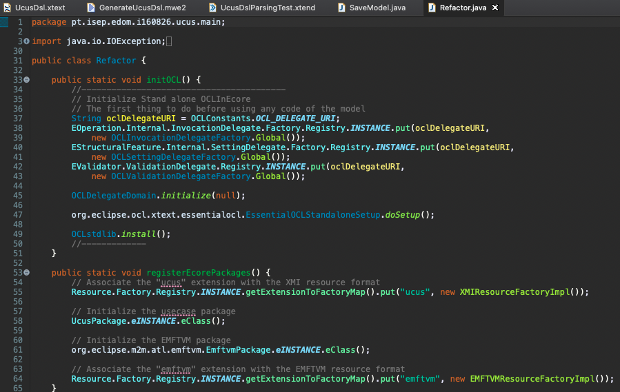

# EDOM Project, Part 3 Assignments

In this folder you should add **all** artifacts developed for part 3 of the EDOM project, related to Eclipse projects.

**Note:** If for some reason you need to bypass these guidelines please ask for directions with your teacher and **always** state the exceptions in your commits and issues in bitbucket.

---

## Installation and Configuration
The installation of the Eclipse IDE and Modeling Tools (EMF) is essential and mandatory for the realization of Project 3.

**Note:** This tutorial was reproduced on the macOS Catalina operating system and requires the installation of the Java Development Kit (min. Version 8).

### Eclipse IDE and EMF Installation Guide: 
1. Download Eclipse installation package from "https://www.eclipse.org", in this guide was used the version 2020-06;
2. Execute the artefact downloaded on previous step;
3. After Eclipse IDE instalation concluded, open the IDE and click option 'Help -> Install New Software...' and make paste the link 'http://download.eclipse.org/releases/2020-06' to 'Work with:' field; 
4. Select 'Modeling' option in the list below, make sure all elements inside the option are selected, click next to install;
5. After the last step, the Eclipse IDE will ask you to restart, select yes;
6. With Eclipse IDE already initialized, all the EMF stuff should be correctly installed.

### Eclipse IDE PlantUML and Asciidoc Installation Guide: 
**Note:** The previous guide (Eclipse IDE and EMF Installation Guide) is required.

1. Open Eclipse IDE and click option 'Help -> Eclipse Marketplace' search for 'PlantUML' and 'Asciidoc'; 
2. Select option install and follow the wizard. 

---

### Assignment 1 - Modeling

#### UCUS UML Model

#### UCUS Example

**Note:** This UML diagrams was generated after theorical lesson Eclipse demonstration, using de Ecore model.

---

### Assignment 2 - Modeling Constraints

#### UCUS UML Model
For this assignment, some changes were made to the previously developed model.

Constraints Implementation:

For testing the constraints developed on the UCUS model using OCL, the Xtext OCL console was used.

---

### Assignment 3 - Model Transformations
For this task, some changes were made to the model previously developed, the attribute "Name" needs a small refractor.

The MANIFEST.MF file was updated. 

The classes Refractor.java and Model2Model.java was added to the project src.

Added some transformations.

---

### Assignment 4 - Concrete Syntax for UCUS
For this assignment, the project of Assignment 3 was reused, and converted to Xtext Project. 

Generated Xtext Projects and DSL.

Created DSL Unit Test.

---

### Assignment 5 - Code Generation for UCUS
For this assignment, the project of Assignment 4 was reused.

Creation of all artifacts to code generation:

Execution of initial Main class, with console application:

UCUS DSL Generator Class:

Execution of DSL, with dynamic creation of class: 

Unit tests execution:

---

## Industry Cases

### i2S Insurance Knowledge
i2S is expertise in insurances solutions, with over 30 years in the market.
They help insurers to reduce costs, to react promptly to market changes and to create competitive advantages via a reliable, consistent and positive insurance software experience.
The was buyed by a group actually called Inetum Group (https://gfi.world/pt-pt/).
Using Gartner reports, the company set the goal of evolution in order to become the leader, migrating an old as400 (IBM) life insurance tool to a new powerfull application based on DSLs.

**Presenter:** Marco Perestrello
**Role:** Chief Thecnology Officer

#### Model-Driven Engineering 
- Principles 
    * **"For instance, how they address 'models+transformations=software'?"** 
    - Initially they were thinking about making Code-to-Code transformations, that is, transforming a line of RPG code in Java, but concluded that it would be expensive and not makeable;
    - Code-to-Model transformations start to make sense, so they created models for the various layers of the application;

- Use Cases 
    * **"For instance, it is a forward engineering case or a reverse engineering case?"**
    - It's a case of reverse engineering, the need to know and split up a giant software developed in RPG to be migrated to Java;
    - Develop DSL's reversing the RPG code, in order to focus only on the key concepts;
    - They used forward engineering to create the Java code based on DSL's;

- Model-Driven Architecture (MDA) and UML 
    * **"Are MDA or any of its principles followed?"** 
    - N/a;

    * **"How does the case relates to UML?"** 
    - N/a;

- Integrating MDSE in the Development Process 
    * **"How does the case relate to Domain-Driven Design?"** 
    - The representation of business concepts, translate into concepts listed in specific DLS's;

    * **"How does the case relates to Tests oriented approaches (e.g., Test-Driven Development)?"** 
    - They can perform a test plan on their tool, as shown in the demo, comparing the result of the execution with that predicted by the user;
    
    * **"How does the case relates do Agile approches?"** 
    - The close relationship with customers, and the joint development of platforms with customers from different countries with extremely different needs, demonstrates the company's ability to adapt;
    -  This migration requires a huge array of changes at the organizational level (IDE's, documentation, tools, tests);

- Domain-Specific Languages 
    * **"Are there DSLs in the case? How can we characterize the DSLs?"**   
    - Yes, there are DSL in this context;
    - DSL's were used for the application layers, developed in MPS, and DSL's for the infrastructure using Xtext (DataTypes, DataStructure, Validations, Test, others);
    - Each DSL concept, in MPS, has an editor that will structure the language syntax visually;

- Tools used 
    * **"What MDE tools are used in the case? How they relate to the ones in the EDOM course?"**
    - Atlassian Confluence to documentation and other current tools (jenkins, others);
    - Xtext
    - The company uses Jetbrains MPS, exatcly the same tool as EDOM, to develop DSL's in a custom IDE version which is included in the IntelliJ;
    - Have their own environment based on the tools above;
    - This application (previous point) presents different types of users with different privileges;
    - Demo on MPS, IntelliJ, and specific i2s enviornment;

#### Software Product Lines 
- **"Is there a Domain Engineering process in the case?"** 
    - The company has a solid knowledge in the insurance area and with many years of experience, so the developments are made with a view to the product (auto, life, housing, others);
    - They need a structure (tree) that allows to fit all types of products;
    - An insurance product, through configurations, becomes a set of behaviors, just like a code excerpt (Java, C++, others), which in the final configuration is what will be delivered to the customer;

- **"Is there an Application Engineering process in the case?"** 
    - The software needs to be highly configurable and allow to be extended over the long term with the arrival and customization of new products on the market, reducing the production costs;

- **"Is there Product Line Management process in the case? How to management and technical aspects integrate?"** 
    - They need to fit behaviors of dozens of pieces of software in order to obtain their final product;
    - The business can present 9000 configurable parameters;

- **"Are there Variability Models involved in the case?"**
    - The structure (tree) mentioned above, works with a piece of software that allows you to fit other software, in order to obtain the product you want, with very specific configurations.

---

### OMNIA

OMNIA is a Low-Code Application Development Platform, a company of PRIMAVERA BSS Group, and was created in 2012.
This Plataform is cloud-based, and the company's main mission is to solve complex problems of its customers, like timesheets, product and order managment. They abstract all the business concepts.
They are a team of 6 people, with a background in technologies such as .Net, React, Postgres, others, who decided to invest in metamodeling.

**Presenters:** Guilherme Ferreira and Diogo Teixeira

#### Model-Driven Engineering 
- Principles 
    * **"For instance, how they address 'models+transformations=software'?"** 
    - On the omnia platform, with just a few clicks they can create an entity with personalized attributes, which will be made available to the user;
    - This created entity, automatically, it will have an associated interface to create new elements of this object, as well as consult existing ones (transactions or entities);

- Use Cases 
    * **"For instance, it is a forward engineering case or a reverse engineering case?"**
    - Reverse engineering when they study the metalanguage developed by OMG Group, to create they own EMOF (Meta-Object Facility) who contains BML (Business Modeling Language), UIML (User Interaction Modeling Language), QML (Query Modeling Language) and SML(Security Modeling Language);

- Model-Driven Architecture (MDA) and UML 
    * **"Are MDA or any of its principles followed?"** 
    - Based on a multi-level meta-modling, with 4 levels Data (M0) where the user interacts, Model (M1) instantiation of concepts, Meta-Model (M2) and Meta-Meta-Model (M4);

    * **"How does the case relates to UML?"** 
    - The UML contains a lots of components, and the OMG Group has a metalanguage above of UML who can easily describe the UML components;

- Integrating MDSE in the Development Process 
    * **"How does the case relate to Domain-Driven Design?"** 
    - The DSL, taking into account the demonstrations, seem completely directed to the domain of the problems

    * **"How does the case relates to Tests oriented approaches (e.g., Test-Driven Development)?"** 
    - N/a;
    
    * **"How does the case relates do Agile approches?"** 
    - N/a;

- Domain-Specific Languages 
    * **"Are there DSLs in the case? How can we characterize the DSLs?"** 
    - BLM (Business Language Modeling) consists in a event/commitment system with a agent and resource, the agent is capable of deal with domain objects like Customers, Supliers and Employees, the resource is more directed to transaction elements like Items, Cash and Orders;
    
- Tools used 
    * **"What MDE tools are used in the case? How they relate to the ones in the EDOM course?"**
    - Eclipse with Xtext was mentioned;
    - OMNIA is a web plataform, can be used with a normal browser, and all the apps developed are responsive to different type of devices;

#### Software Product Lines 
- **"Is there a Domain Engineering process in the case?"** 
    - All the apps developed with OMNIA consists on a single runtime, with the same languages (Modeler, Management, Security, Expense Management, Order Management);

- **"Is there an Application Engineering process in the case?"** 
    - With the first step Structure Modeling and the second Behaviour Implementation, the result is a Web App and API;

- **"Is there Product Line Management process in the case? How to management and technical aspects integrate?"** 
    - N/a;

- **"Are there Variability Models involved in the case?"**
    - N/a;

---

### OutSystems
OutSystems is the world leader developing applications low code!
The company was founded in 2001 in Lisbon and has more than 1300 employees in more than 25 countries.

They provide high quality and complex applications (Web and mobile), with resources for tools that do not cover traditional programming.
These are the main stages of development:

* **Discover ->** Research, Framing, Ideation;
* **Prototype ->**  Concepts, Mockups, Testing;
* **Deliver ->** Design, Review, Testing;
* **Tweak ->** Observation, Metrics, Tunning.

**Presenter:** Rui Couto

**Role:** Outsystems Product Design - Responsible to understand the problem, research and design the solution to the final product.

#### Model-Driven Engineering 
- Principles 
    * **"For instance, how they address 'models+transformations=software'?"** 
    - With Outsystems language simplified models, they can generate MVC, client-side and server-side applications logic, exchanging data only strictly necessary; 

- Use Cases 
    * **"For instance, it is a forward engineering case or a reverse engineering case?"**
    - I think we can consider reverse engineering in the investigation of concern to understand how other tools on the market work (Excel, Orange, others), and try to overcome them;
    - Otherwise, consider forward engineering as they develop their own tools and models;

- Model-Driven Architecture (MDA) and UML 
    * **"Are MDA or any of its principles followed?"** 
    - N/a

    * **"How does the case relates to UML?"** 
    - The Outsystems language was created based on UML, a simplified version with only the necessary elements;

- Integrating MDSE in the Development Process 
    * **"How does the case relate to Domain-Driven Design?"** 
    - N/a

    * **"How does the case relates to Tests oriented approaches (e.g., Test-Driven Development)?"** 
    - In the development steps 'Prototype' and 'Deliver' there are moments of testing;

    * **"How does the case relates do Agile approches?"** 
    - Constant communication with the client to understand the requirements and how they will improve their work;

- Domain-Specific Languages 
    * **"Are there DSLs in the case? How can we characterize the DSLs?"** 
    - Yes, Outsystems uses DSL's;
    - They have their own DSL called "Outsystems", usually simpler syntax mainstream languages and not necessarily textual;
    - Abstract details, resolving a specific problem;
    - The development has three types of DSL: Logic, UI and Data;
    - DSL Logic: Abstract decisions in a given context;
    - DSL UI: Can abstract visual development, like HTML;
    - DSL Data: Transforms in SQL;
    - Xtext DSL was used;
    - Behind these DSL the programming languages ​​commonly used are used (Javascript, C#, otherss);

- Tools used 
    * **"What MDE tools are used in the case? How they relate to the ones in the EDOM course?"**
    - They have a tool developed internally, the Outsystems Platform - Service Studio;
    - Easily integrates with existing systems, like SAP, SOAP, REST, and others;
    - It is possible add own custom code;
    - Xtext on Eclipse was used on the first functional prototype;
    - The same tool used in the EDOM course;

#### Software Product Lines 
- **"Is there a Domain Engineering process in the case?"** 
    - N/a

- **"Is there an Application Engineering process in the case?"** 
    - N/a

- **"Is there Product Line Management process in the case? How to management and technical aspects integrate?"** 
    - Described above in the introduction;

- **"Are there Variability Models involved in the case?"**
    - N/a

---

### Msg Life

Msg Life Company has more than 35 years in insurance market, and counts with over 1100 employees ditributed by Germany and Portugal (more than 50 in Porto).

**Presenter:** José Pinho

#### Model-Driven Engineering 
- Principles 
    * **"For instance, how they address 'models+transformations=software'?"** 
    - The company develop most of his products using Product Definition System, the starting point for developing new models. 
    - MSG Life uses to PDS Adapters, in order to allow customized customization of products.

- Use Cases 
    * **"For instance, it is a forward engineering case or a reverse engineering case?"**
    - Forward Engineering, the developed models are the main artifact on software development;

- Model-Driven Architecture (MDA) and UML 
    * **"Are MDA or any of its principles followed?"** 
    - MSG Life relies on metamodeling, DSL's and OCL's to develop the product oriented to specific business domains;

    * **"How does the case relates to UML?"** 
    - The UML is used to define a high-level overview of the component diagrams of its system and to provide details on how a given REST HTTP request can be carried out through its flow of DSL;
  

- Integrating MDSE in the Development Process 
    * **"How does the case relate to Domain-Driven Design?"** 
    - N/a

    * **"How does the case relates to Tests oriented approaches (e.g., Test-Driven Development)?"** 
    - N/a
    
    * **"How does the case relates do Agile approches?"** 
    - N/a

- Domain-Specific Languages 
    * **"Are there DSLs in the case? How can we characterize the DSLs?"** 
    - Yes, the Flow, an Internal DSL used for UI generation);
    - Flow is based on a structured text notation (XML based), this syntax developed with well-defined rules;
    - Can be used by different apps in the msg life iberia system;
    - Used for code generation;

- Tools used 
    * **"What MDE tools are used in the case? How they relate to the ones in the EDOM course?"**
    - During the presentation, the use of the Apache Velocity was metioned in order to generate code;
    - JXPath;
    

#### Software Product Lines 
- **"Is there a Domain Engineering process in the case?"** 
    - N/a

- **"Is there an Application Engineering process in the case?"** 
    - N/a

- **"Is there Product Line Management process in the case? How to management and technical aspects integrate?"** 
    - N/a

- **"Are there Variability Models involved in the case?"**
    - N/a