# EDOM Project, Part 3 Assignments (Tool)

In this folder you should add **all** artifacts developed for part 3 of the EDOM project, related to your selected Tool projects.

**Note:** If for some reason you need to bypass these guidelines please ask for directions with your teacher and **always** state the exceptions in your commits and issues in bitbucket.

---

## JetBrains MPS

### Assignment 1 - Modeling

1. How do the modeling concepts of your tool compare to EMF and Ecore?
2. How does code generation for the model compares between EMF and your tool? If the tool does not generate code explain how it works.
3. What APIs are available to manage models in your tool? How they compare to EMF? How models are persisted in your tool? How does it compare to EMF?

#### **Answers:**
- **Answer 1:**
    - In JetBrains MPS it is possible to create projects with *languages* defined by the developer, similar to Ecore projects created with Eclipse EMF;
    - Ecore's *class* concept is represented by *concepts* in MPS. These, as a good practice, can extend to the *concept* called *INamedConcept* and inherit the *Name* property of type *string*, with *properties* corresponding to the attributes in an Ecore model;
    - It is necessary to define whether or not the *concept* may be a *root* element of the language;
    - The *properties* of the *concept* can be any attribute that describes it, with primitive data type;
    - The creation of *concepts* in MPS, similar to Ecore, allows the creation of relations between elements of language, the field *children* describes the relations of this *concept* with the remaining *concepts* of the model, being possible to indicate the cardinality;
    - In languages developed with MPS it is not possible to represent bi-directional relationships.

    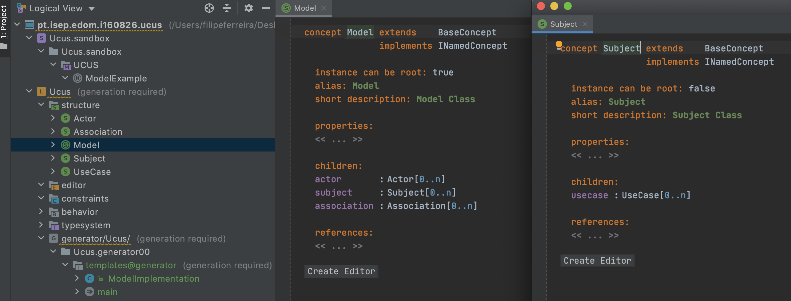
    
    - Important note: children and references are completely different. E.g. you can create a child node if you have a parent node, but can't create node if you have a referent node - you first need to create a node as a child of some other (or as a root), and then reference it.

- **Answer 2:** 
    - The MPS allows to generate Java code of the developed language;
    - It is necessary to create a *Generator* from the language, it will be able to obtain Java code;
    - However, it is essential to keep in mind the type of result of the code that is intended.

- **Answer 3:**
    - After the development of the specific language, it is recommended to create a Sandbox project, which allows you to import the developed language and create models from it, as shown in the image below: 

    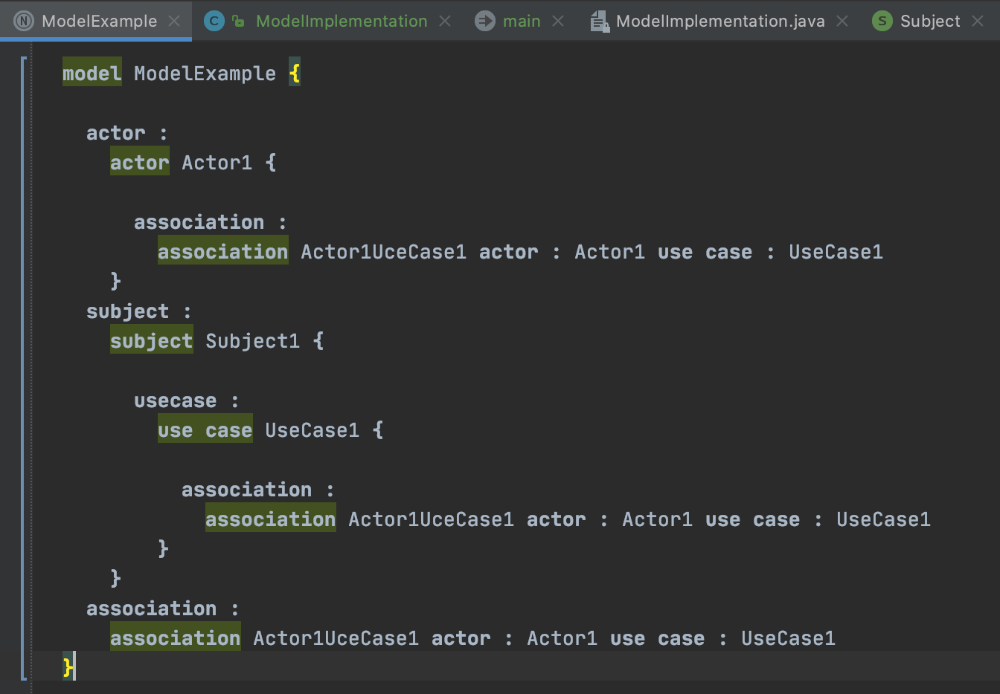

    - The reproduction of the model of the developed language in *Sandbox* is validated in real time, that is, there is an associated auto-complete functionality.

---

### Assignment 2 - Modeling Constraints

#### Constraints demonstrated in class:

1. Names should not be empty;
2. Names should have at least 10 characters;
3. Names should start with uppercase;
4. Use cases should have a read-only attribute returning their description;
5. Use cases should have a read-only property returning ’all’ directly and indirectly included use cases;
6. A use case cannot include directly or indirectly itself;
7. A Use case should have a read-only property returning its including Subject;
8. A use case cannot include a use case of another subject.

Constraints 1, 2, 3, 4, 5 and 7:

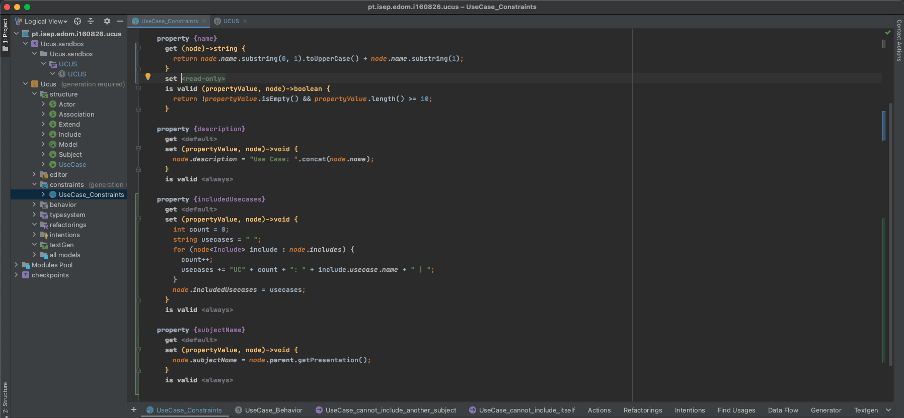

Constraints 6 and 8:

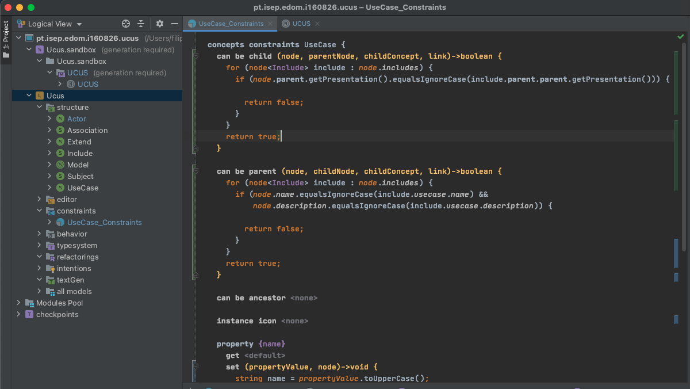

### Questions:
1. How does the constraints support of your tool compares to EMF and Ecore?
2. The tool supports a language similar to OCL (a DSL for constraints)? Or constrains are specified in code (in a GPL)?
3. What APIs are available to validate "programmatically" models in your tool? How they compare to EMF?
4. Does the tool has support to interactively execute queries on models (instances)? How does it compare to the query expressions of OCL?

#### **Answers:**
- **Answer 1:**
    - JetBrains MPS natively supports Constraints and pretends express advanced aspects and rules on the language structure;
    - Each concept can have a class of constraints that have a predefined structure, similarly to Ecore:

    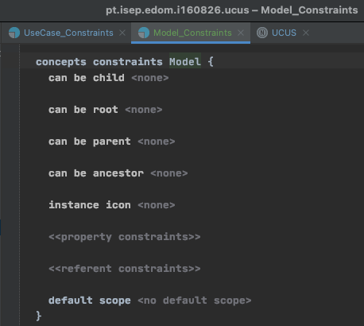

    - In constraints, it is possible to define rules that validate the integrity of the model elements, as shown in the images above, the same ideological basis as Ecore;
    - These can be used to refactoring attributes of the Concepts;
    - This tool intends to assign and divide responsibilities for validations, assigning a constraint section for each Concept, not just a file like Ecore;
    - More detailed information: *https://www.jetbrains.com/help/mps/constraints.html*;

- **Answer 2:** 
    - MPS uses a programing language based on Java, unlike to Ecore which uses OCL (declarative), a language applicable in UML model;

- **Answer 3:**
    - In Ecore we can use Xtext console to validate the model, but MPS presents a native tool called 'Model Checker';
    
    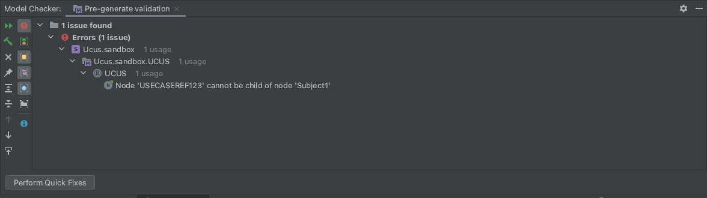

- **Answer 4:**
    - The tool supports SModel language Modification operations allowing a huge variety of interactions with the model concepts;
    - More detailed information: *https://www.jetbrains.com/help/mps/smodel-language-modification-operations.html*; 
    - In the instantiation of the model, inputs of concepts are suggested:
    
    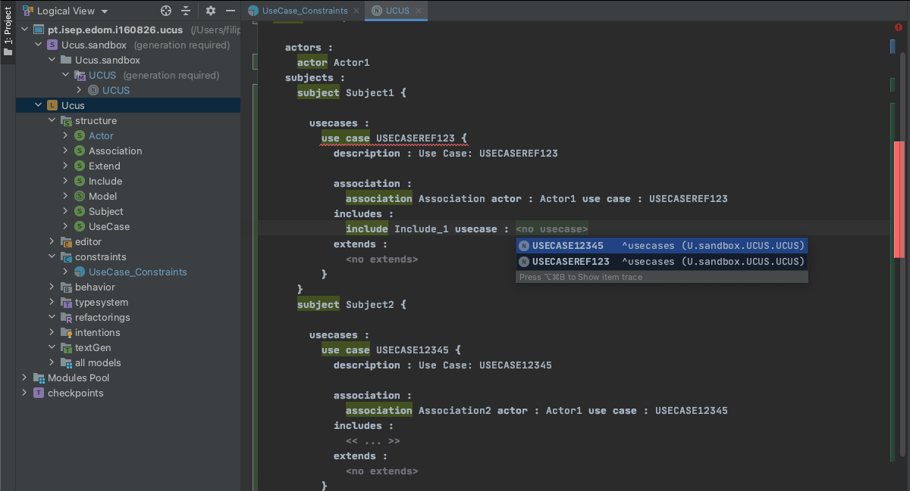

---

### Assignment 3 - Model Transformations
1. How does the model transformation support of your tool compares to ATL?
2. The tool supports a language similar to ATL (a DSL for model transformations)? Or transformations are specified in code (in a GPL)?
3. Are transformations rules in the transformation language declarative (as ATL) or imperative?

#### **Answers:**
- **Answer 1:**
    - This tool presents some options to apply transformations on models. The constraints presented on previous Assigment can apply transformations, for example, seting the first character of Name to Upper;
    - The MPS also has tools like Typesystem and Refactoring, these two were explored, but I couldn't get any concrete results; 
- **Answer 2:** 
    - MPS uses a programing language based on Java and can be declarative or imperative behavior, unlike to Ecore which uses ATL (imperative);

- **Answer 3:**
    - In MPS the concept of transformations can be related to constraints, presenting the declarative and imperative sense;
    - The Sandbox can signal the part of the model that has errors, and can also set the elements automatically.

---

### Assignment 4 - Concrete Syntax for UCUS
1. How does the concrete syntax offered by Xtext compares to that of your tool?
2. Classify both, justifying. Use the same classification categories as presented in lecture 4. 
3. What is the file format used to persist the dsl files in your tool? How does it compare to Xtext? Explain scenarios when the Xtext approach can have advantages when compare to your tool, and also when the approach of your tool could be better.

#### **Answers:**
- **Answer 1:**
    - The MPS is fundamentally a textual DSL, works with a projection-based editor that just "looks" like text while we develop;
    - In the case of Xtext, is a parser-based approach that works with ordinary textual files;
    - For this assignment, I decided to create Editors for my language concepts, in order to change the notation originally provided by the tool. This is not the main purpose of the assignment, but it is comparable;
    
    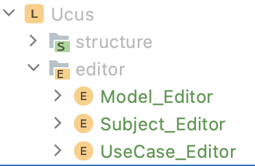

    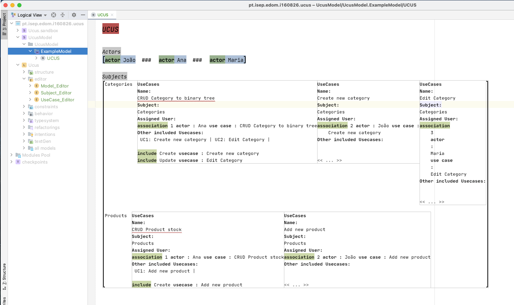

- **Answer 2:** 
    - **Focus:** 
        - **Vertical DSL -** N/a;
        - **Horizontal DSL -** Xtext and Jetbrains MPS, both are not developed for to a specific industry and they are used by programmers to help non technical people work;

    - **Style:** 
        - **Declarative DSL -** Jetbrains MPS, as a explained on assignment 3, uses a programing language based on Java and can be declarative or imperative behavior, the custom Editors can represents a declarative way; 
        - **Imperative DSL -** Jetbrains MPS (explained above) and Xtext, as it is a syntax developed with well-defined rules (Xtext), it is not possible to follow a structure other than that present in the DSL;

    - **Notation:**
        - **Graphical DSL -** N/a;
        - **Textual DSL -** JetBrains MPS and Xtext. They are based on structured text notations;

    - **Internality:** 
        - **External DSL -** Xtext and JetBrains MPS, according to the tool website, MPS is capable of mixing external DSLs, by letting for example DataUx extend the internal Java DSL implementation 
        (https://blog.jetbrains.com/mps/2017/10/domain-specific_languages_modelling_user_interfaces/). DataUx is a Sql Query Proxy to Elasticsearch, Mongo, Kubernetes, BigTable, etc, (https://github.com/dataux/dataux);
        - **Internal DSL -** N/a;

    - **Executability:**
        - **Model interpretation -** Jetbrains MPS;
        - **Code-generation -** Xtext, as studied in assignment 5 Xtext applies a complete model-to-text (M2T) transformation at deployment time, thus producing an executable application.

- **Answer 3:**
    - The Jetbrains MPS uses a store format tool-specific (unusable without special programs) and does not parse plain text files. Uses a specific file format.
    - As studied in this course, Xtext consists in a ordinary textual files (.mwe2, .xtext, java, xtend) that can be, stored and compared with any version control system and even modified outside the editor, this is an positive point compared to MPS. As we studied, Xtext can integrates into Eclipse EMF.
    - One of the big differences and at same time advantage to MPS is that in MPS the model is edited directly and this model is shown in real time in a syntax/editor view. In Xtext wexs edit the syntax and the model is generated/parsed.
    - Example of import MPS Language to use in the development of another language:

    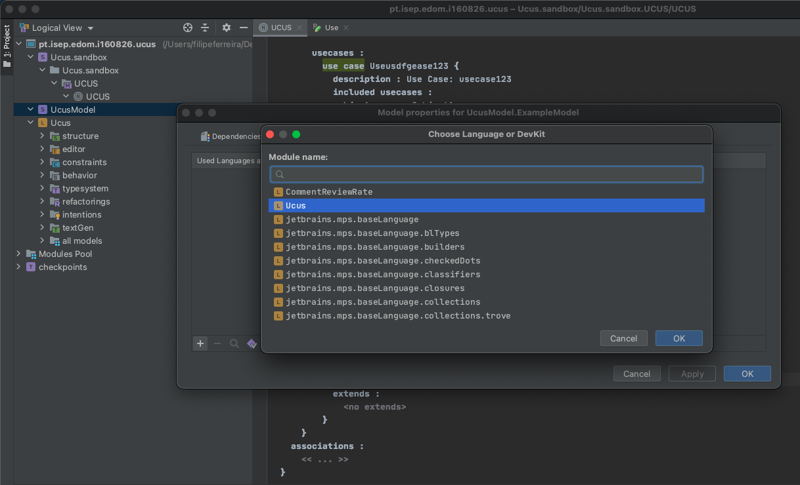

---

### Assignment 5 - Code Generation for UCUS
1. How does the code generation features offered by Xtext compares to that of your tool?
2. It is based on templates or it offers other approaches? If based on templates, explain how its features compare to Xtext/Xtend. If not based on templates, explain the mechanism used to generate text.
3. How can you manage the possible customization of generated code so that it is not lost when the generation process is executed again? Does the tool provides any special support for this or do you have to use patterns, like in this example?

#### **Answers:**
- **Answer 1:**
    - Like Xtext, using Generator of MPS to code generation, we are creating code based on models/templates;

    - MPS offers another alternative, called genText, which was not explored in this assignment;

- **Answer 2:** 
    - JetBrains MPS Generator is based on templates;
    - We can define a template for each concept that will be represented in code:

    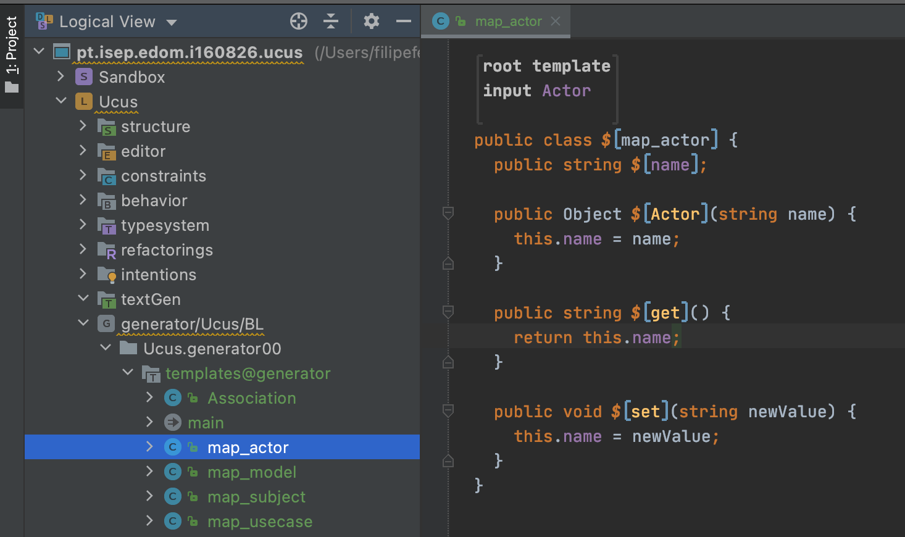

    - In the Generator there is an artefact of the type mapping consfiguration that is in charge of orchestrating the generation of the code, similar to the UcusDSLGenerator class used in Xtext:

    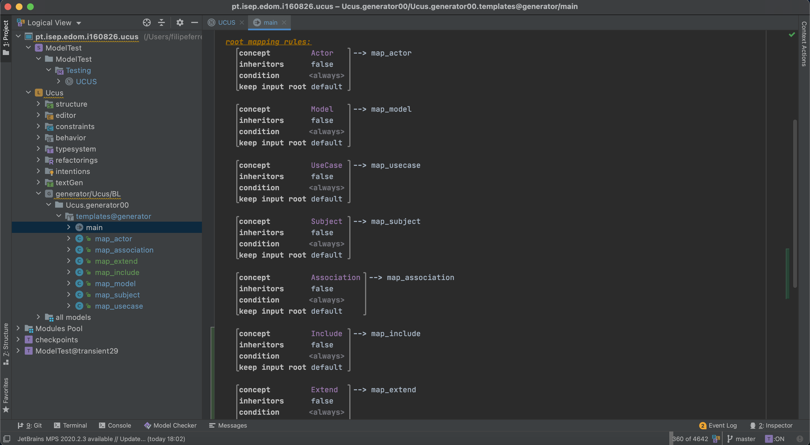

    - To create dynamically instances of concepts, was used the *map_model*: 

    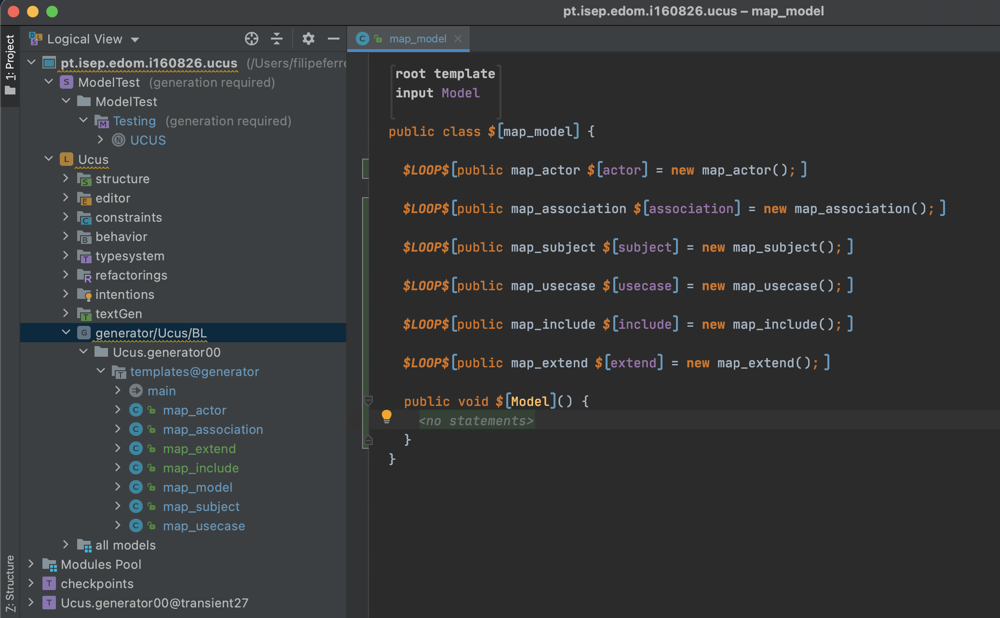

    - Example of generated code:

    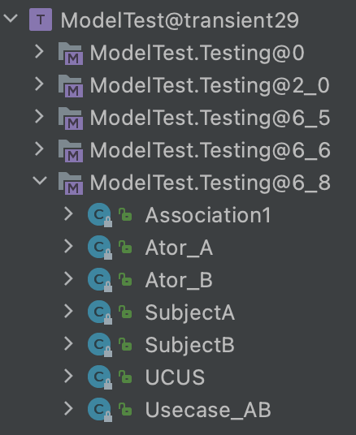

    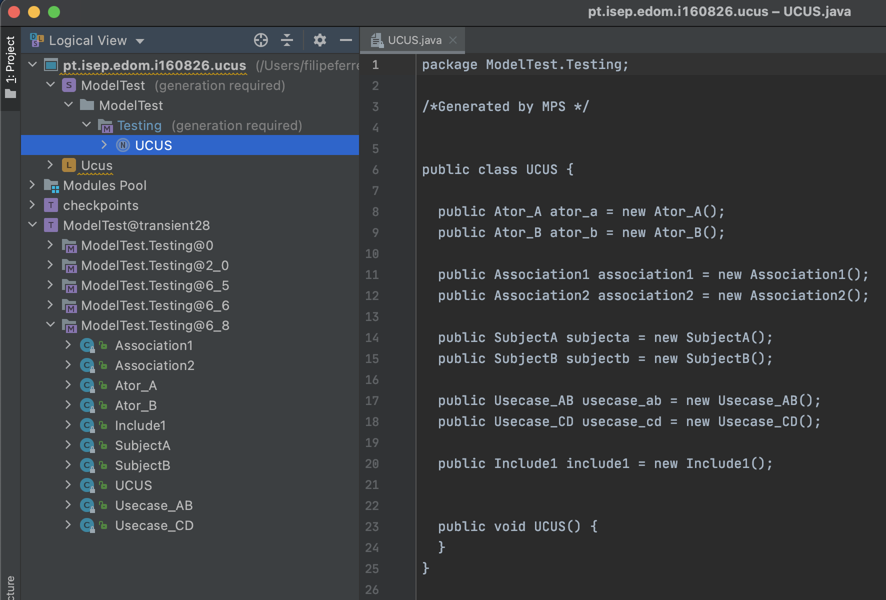

- **Answer 3:**
    - Code generation in the mps tool is based on the DSL developed;
    - The updated generation trace is inspired by the idea to track actual changes only;
    - It's much less demanding, as only the changes nodes are being tracked.
    - Example of code generated based on templates:

