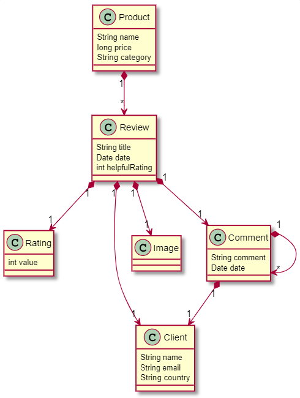
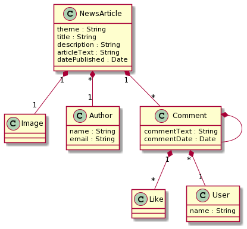
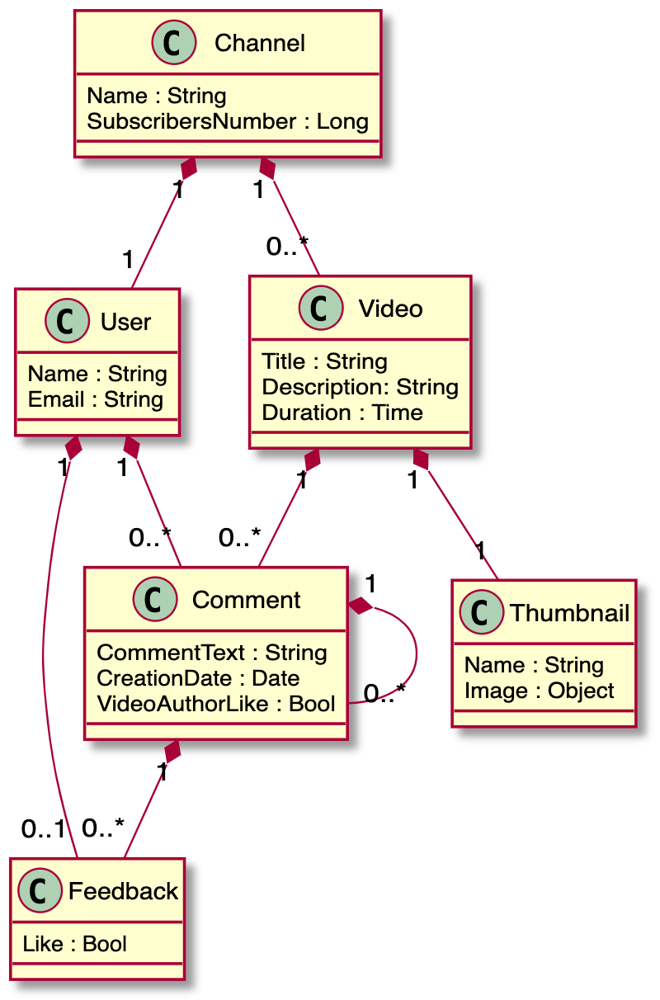
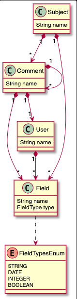
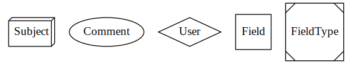

# EDOM Project, Part 1 - Team Report

In this folder you should add **all** artifacts developed for part 1 of the EDOM project, related to team/group work.

**Note:** If for some reason you need to bypass these guidelines please ask for directions with your teacher and **always** state the exceptions in your commits and issues in bitbucket.

Following there are examples of proposed sections for this part of the report (team part).

## Domain Knowledge Obtained from Analyzing the Applications

## Activity 3: Research Existing Apps
#### E-commerce Site

After analyzing the Amazon E-commerce Review the following conclusions can be asserted:

* The subject of our application are products
* Customers can review and rate products
* A review is composed of a small text and a rate in the range 0-5
* Customers may also attach pictures to their review
* Reviews are automatically publish but other customers may report abuse and/or evaluate whether it is a review that helps other customers to know more about the product or not

#### News Article

After analyzing the news article from [Publico](https://www.publico.pt/) as well as other online newspapers like [noticiasaominuto](https://www.noticiasaominuto.com/), the following conclusions can be asserted:

* The subject of our application are news articles
* An article contains a single author but an author can write various news articles
* An article contains a title, a short description, its publish date and an image related to the topic, supporting the article text itself
* Identified/Registered users can comment on articles
* Comments are simple text, without formatting and are accompanied by the comment's publish date
* Other users can reply to comments

### Video Sharing Platform

For the free choice area, the [YouTube](www.youtube.com) video sharing platform was selected.
Briefly, the topics below describe the main features and rules of interaction presented by the platform:

* The subject of our application is to enable anyone to share their own videos;
* The platform consists of video channels with one author and his subscribers;
* Each video is posted by an author on his channel and contains a title, description (optional), publication date, duration and thumbnail;
* Videos also have complementary and incremental information, resulting from the interaction and opinion of users registered on the platform, such as comments, likes/dislikes and views;
* Comments left by users may contain other comments, likes/dislikes and the love reaction of the video author (all commnets have date);

---

## Design of the Metamodel
## Activity 4: Design Domain Metamodel

---

## Constraints and Refactorings
## Activity 5: Design Metamodel Constraints and Transformations

To have a Model that respect the designed metamodel, there were defined some constraints for each class:

* **Subject**
    * nameMustBegreaterThan1Char - each subject cannot have a blank or null name
    * mustHaveFieldsWithDifferentNames - a subject cannot have fields with the same name 
    * mustHaveCommentsWithDifferentNames - a subject cannot have comments with the same name 

* **Comment**
    * nameMustBegreaterThan1Char - each comment cannot have a blank or null name
    * mustHaveFieldText - each comment needs to have only one field called 'text'
    * mustHaveFieldDate - each comment needs to have only one field called 'date'
    * mustHaveAtLeast2Fields - each comment needs to have at least 2 fields
    * mustNotIncludeItSelf - a comment cannot have a child comment with the same name as him
    * mustHaveFieldsWithDifferentNames - a comment cannot have fields with the same name
    * mustHaveCommentsWithDifferentNames - a comment cannot have child comments with the same name

* **User**
    * nameMustBegreaterThan1Char - each user cannot have a blank or null name
    * mustHaveFieldsWithDifferentNames - a user cannot have fields with the same name

* **Field**
    * nameMustBegreaterThan1Char - each field cannot have a blank or null name

* **Model**
    * nameMustBegreaterThan1Char - each model cannot have a blank or null name

---

## Metamodel Graphical Representation
## Activity 6: Design Model Visualizations

For each metamodel element, the team chose a different graphically representation:

* Subject - for the Subject, we will be using the plantuml object called **box3d**
* Comment - for the Comment, we will be using the plantuml object called **oval**
* User - for the User, we will be using the plantuml object called **diamond**
* Field - for the Field, we will be using the plantuml object called **square**
* FieldType - for the FieldType enum, we will be using the plantuml object called **Msquare**

---

## Presentations of Models (instances)
## Activity 7: Application Engineering