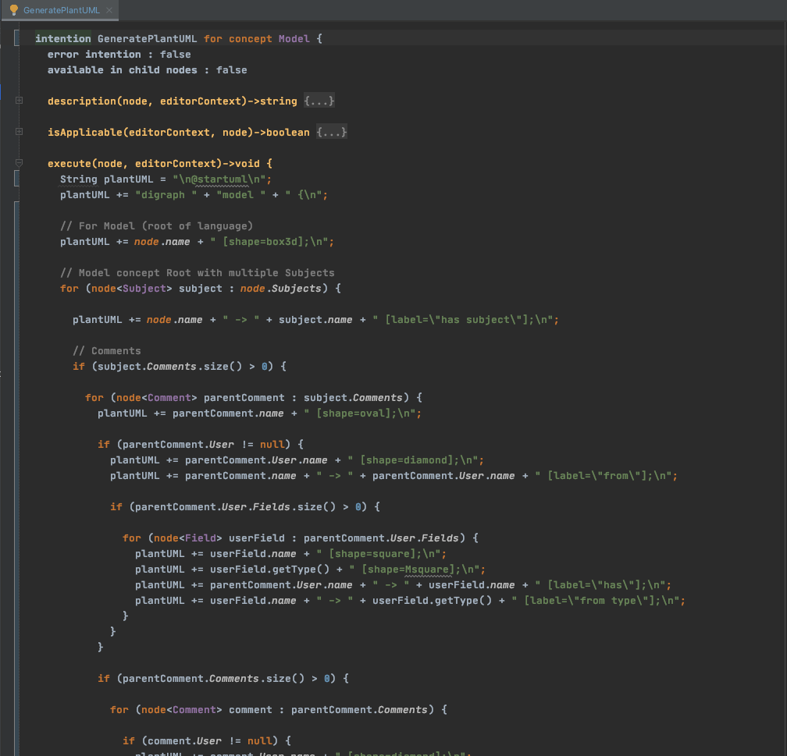
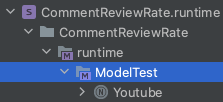

# EDOM Project, Part 1, Tool 1

In this folder you should add **all** artifacts developed for part 1 of the EDOM Project, related to tool 1.

You should also include in this file the report for this part of the project (only for tool 1).

**Note:** If for some reason you need to bypass these guidelines please ask for directions with your teacher and **always** state the exceptions in your commits and issues in bitbucket.

Following there are examples of proposed sections for the report.

---

## Description of the Tool
MPS - Meta Programming System is an open source platform to build Domain-Specific Languages, made available by JetBrains company. 
This tool allows to create new languages, customize and extend them, by any user.

"With MPS you can define custom editors for a new language and make using these DSLs simpler. Even domain experts, who are not familiar with traditional programming, can easily work in MPS with domain-specific languages designed around their domain-specific terminology."

This tool was originally based on language called BaseLanguage (copy of Java). Currently, the tool got additional languages like XML, C, and JavaScript.

On this page its possible to find useful information for learning: 
- https://www.jetbrains.com/mps/learn/

## How to Setup and Install
### Meta Programming System (MPS) - JetBrains on macOS Catalina:
Note: It will be necessary create a JetBrains account to use the tool.

### Method 1:
1. Access the address 'https://www.jetbrains.com/mps/download/#section=zip' and download the version for the desired operating system;
2. Execute the downloaded artifact;
3. After completing the installation process, execute the "Meta Programming System" and agree with the application's usage policies;
4. The Tool is ready to use.

### Method 2:
1. Access the address 'https://www.jetbrains.com/toolbox-app/' and download the application “JetBrains ToolBox” for the version for the desired operating system;
2. Execute the downloaded artifact;
3. Run the “JetBrains ToolBox” and select the “Meta Programming System” application to proceed with the installation, the entire download and installation process will be automatic;
4. Run the “Meta Programming System”.

Note: This app is running in the background whenever the operating system is started.

---

## Implementation of the Metamodel
Initially I started by creating the project containing the **Language**, **Sandbox** and **Runtime** with the 'CommentReviewRate'.

Then I created all the **concepts** (classes) dof the metamodel, with the respective attributes, like for example the **concept** *Subject* below:

For each **concept** it's possible to add a behavior with specific methods for each **concept**, as shown in the image below for the *Field*:

**Note:** All the **concepts** created implement the interface *INamedConcept* that automatically associates an property *name*.

For testing the correct development of **concepts** language, a model was created in the project **SandBox** or **Runtime**:

The model is filled out using the autocomplete and tool suggestions.
After the development of the language it's possible check if contains errors: 

After the execution:

---

## Implementation of Constraints and Refactorings
For this task, the constraints and transformations presented in the general Readme file to the working group were taken into account.

I started by creating a constraint file for each **concept** of the **language**:

Here is the logic developed for the **constraints** of the **concept** Comment.

---

## Implementation of the Visualizations
For this task, I followed the teacher's suggestion to use an **intention** with the logic referring to the creation of the *puml* code.

Consult the file *CommentReviewRate.intentions.mps* on folder 'part1/tool1-mps/CommentReviewRate/models' for complete implementation.

The result is visible on the tool logs:

Now I can copy the generated *puml* data and obtain a image of the model representation.
Consult the file *Visualization.puml* on folder '*diagrams/tool1-mps*'.

Otherwise it would be possible to obtain a *xml* file of the **language** and develop a *java* class for the treatment and management of *plantUML*. 
More information: https://dslfoundry.com/how-to-write-a-dump-of-an-mps-model-to-xml-based-on-its-structure/ 

---

## Implementation of Models (instances)
Using the information already provided in the **Implementation of the Metamodel** chapter, I create a **runtime** project with the **language** '*CommentReviewRate*' as a Used Language.

Now, everything is ready to describe the model:

**Note:**It is possible to generate a readonly model of our instance.

---

## Execution of Constraints and Refactorings
All the constraints and refractorings can be tested in the model editor, as explained and demonstrated in the chapter **Implementation of the Metamodel** (above). It is only necessary rebuild the model.
If some constraint is violated, the node with problems will be marked with an error line, and the **model checker** tool will describe the problems found in the model:

---

## Generation/Execution of Visualizations
This model vizualization was generated with the **intentation** described on **Implementation of the Visualizations** section:

**Note:**The original *puml* file can be found in the folder '*diagrams/tool1-mps/Visualization.puml*'.
On the working team general Readme file, it is possible to find the meaning of each figure.