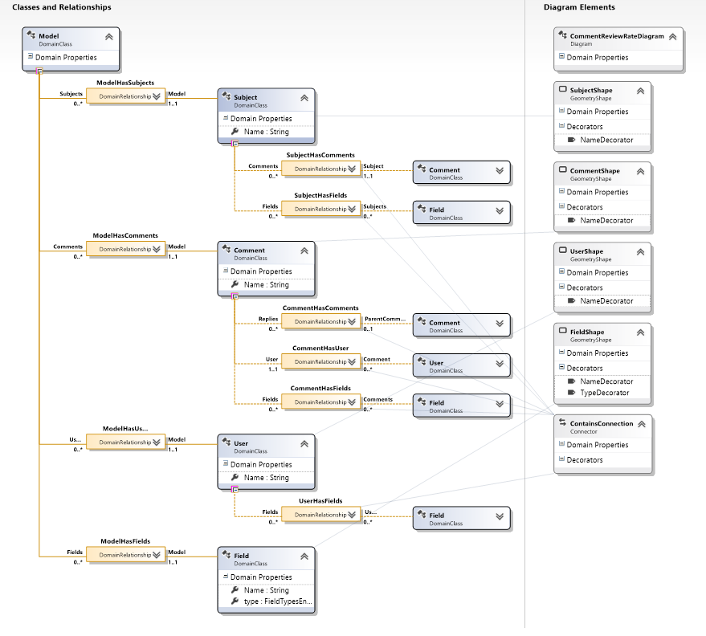
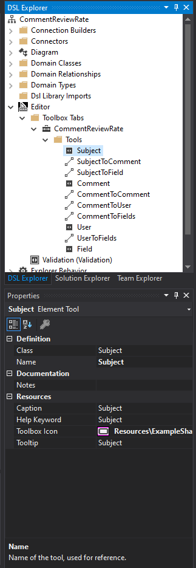
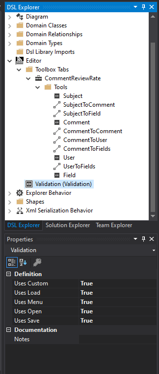
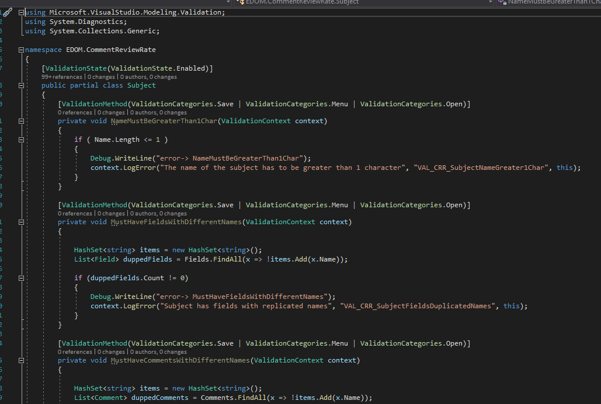
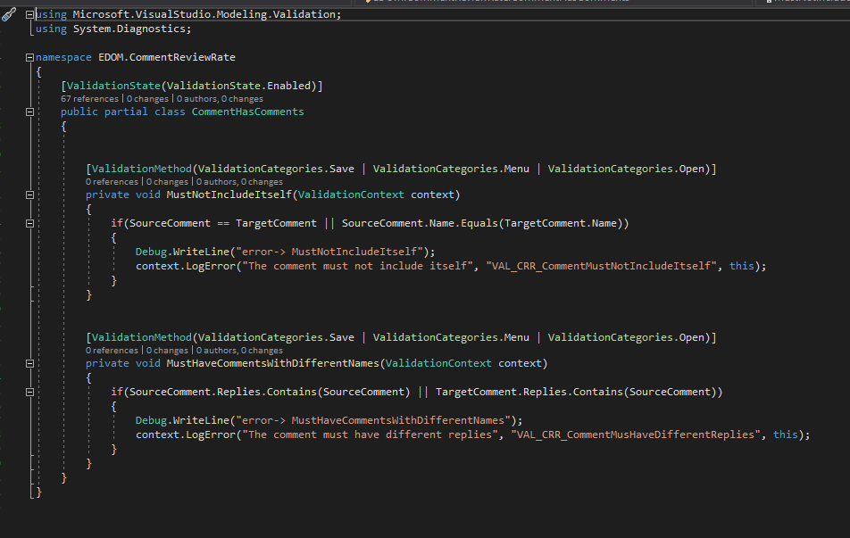
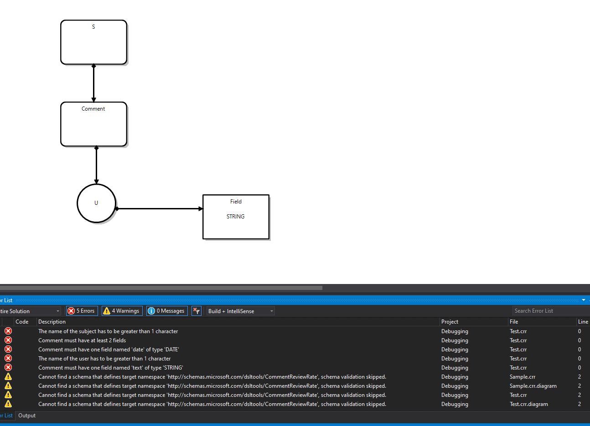
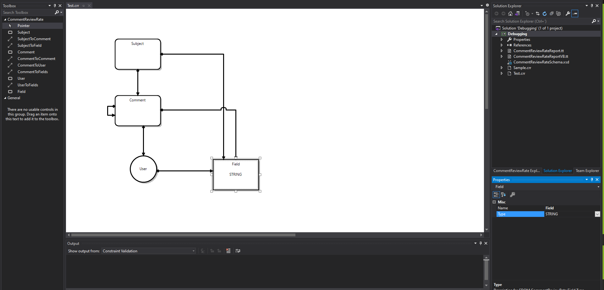
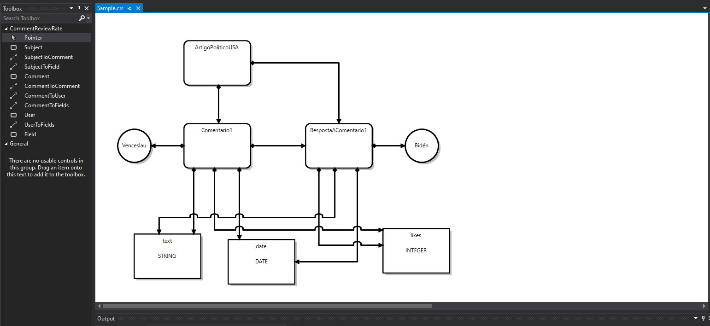
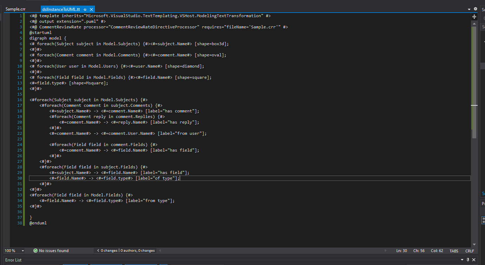
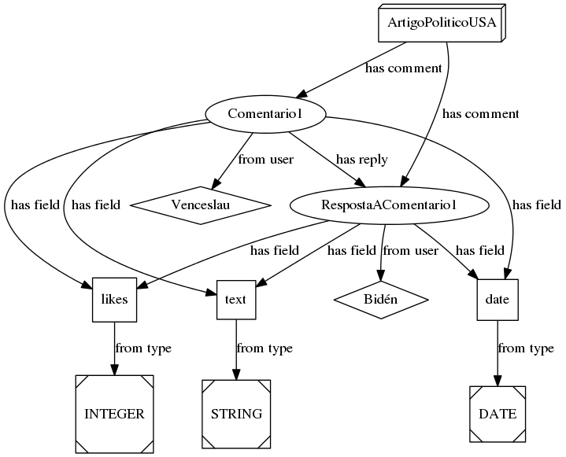

# EDOM Project, Part 1, Tool 2

In this folder you should add **all** artifacts developed for part 1 of the EDOM Project, related to tool 2.

You should also include in this file the report for this part of the project (only for tool 2).

**Note:** If for some reason you need to bypass these guidelines please ask for directions with your teacher and **always** state the exceptions in your commits and issues in bitbucket.

Following there are examples of proposed sections for the report.

## Description of the Tool

Microsoft's Visual Studio Modeling SDK (or MSDK) is a tool that enables the developer to create powerful model-based development tools to integrate with Visual Studio, as well as create one or more model definitions to integrate into a set of tools.

It allows the developer to use tools such as diagrammatic view, code generation abd other artifacts, as well as commands for transforming the model.

## How to Setup and Install

To install Visual Studio's Modeling SDK you have to install Visual Studio. It's a really simple process though.

Start by downloading Visual Studio by accessing this [link](https://visualstudio.microsoft.com/downloads/) and downloading accordingly to your OS.

After running the installation software, a program called Visual Studio installer will execute and from there you can choose which packages to add to Visual Studio to better suit your developing needs. However, to install Modeling SDK, you just have to click "Modify" on the Visual Studio, then access the second tab "Individual Components" and search for "Modeling SDK". Tick that checkbox and then click Install. 

Finally, just launch Visual Studio and start Modeling. (Also pick dark theme or else none of this will work, trust me)

## Implementation of the Metamodel

To implement the metamodel I clicked the New Project in Visual Studio and then clicked "Domain-specific Language Designer" option which I wrote CommentReviewRate as the name of the project leading up to a window were I could chose more options too this solution.
I picked the Minimal Language option as it is the reccomended as well as the most versatile one when it comes to writing DSL's.

After that, I created domain classes and relationships following the design we did as a team before resulting in this DSL

To create domain classes and be able to create them in instances, I had to, for each domain class, add a Shape which contains decorators which will represent where domain properties like the name of the domain class will be seen (TopLeft, Centre, BottomRight, etc.). For the relationships, as they were aesthetically similiar only onde connector was created.

To create options in the DSL instance to create a subject, or a comment for example, I had to create Element Tools in the DSL Explorer tab by right-clicking CommentReviewRate > Editor > Toolbox Tabs > CommentReviewRate and selecting "Add Element Tool" and in the properties of said tools insert which class they represent. The same was done to create the various Connection Tools. The result were these tools that I could use to create my DSL instance.

## Implementation of Constraints and Refactorings

After playing around with DSL instances constraints needed to be added following the team analysis and so all the constraints mentioned before were added, them being:

* **Subject**
    * nameMustBegreaterThan1Char - each subject cannot have a blank or null name
    * mustHaveFieldsWithDifferentNames - a subject cannot have fields with the same name 
    * mustHaveCommentsWithDifferentNames - a subject cannot have comments with the same name 

* **Comment**
    * nameMustBegreaterThan1Char - each comment cannot have a blank or null name
    * mustHaveFieldText - each comment needs to have only one field called 'text'
    * mustHaveFieldDate - each comment needs to have only one field called 'date'
    * mustHaveAtLeast2Fields - each comment needs to have at least 2 fields
    * mustNotIncludeItSelf - a comment cannot have a child comment with the same name as him
    * mustHaveFieldsWithDifferentNames - a comment cannot have fields with the same name
    * mustHaveCommentsWithDifferentNames - a comment cannot have child comments with the same name

* **User**
    * nameMustBegreaterThan1Char - each user cannot have a blank or null name
    * mustHaveFieldsWithDifferentNames - a user cannot have fields with the same name

* **Field**
    * nameMustBegreaterThan1Char - each field cannot have a blank or null name

* **Model**
    * nameMustBegreaterThan1Char - each model cannot have a blank or null name

In Visual Studio Constraints are represented by Validations, and before writing some I had to enable them like so:

After enabling Validations all I had to do was create a partial class of the domain class I wanted to put the validation, for example for Subject validations I created a Subject.cs with a partial class like this:

All annotations such as `[ValidationState(ValidationState.Enabled)]` above the class and `[ValidationMethod(ValidationCategories.Save | ValidationCategories.Menu | ValidationCategories.Open)]` before each method are necessary for when a user validates its instance the ValidationController passes through these validations. I used 3 Validation Categorioes: Save, Menu and Open, which means that these validations will run when the DSL instance is Saved, validated through the Menu option as well as when it is Opened.

One special case I had to do a partial class of a domain relationship which can also be done to simlify certain validations:

One disadvantage of this easy validation method is not being able to put these validation files/partial classes somewhere more organized as they need to be at the same level as the DslDefinition.dsl file.

According to refractorings, no refractors where needed thanks to the strong constraints we have, however, even if I intended to refractor the model it would go against the documentation of this tool. *It is usually better to let the user decide how to correct an invalid model.* as it can be seen [here](https://docs.microsoft.com/en-us/visualstudio/modeling/validation-in-a-domain-specific-language?view=vs-2019#alternatives);

## Execution of Constraints and Refactorings

When executing the constraints implemented below it is possible to see they are woking:

## Implementation of the Visualizations

I could not find a way to represent my DSL through the Modeling SDK, however Visual Studio has a cool view that represents the instance of the DSL and allows the user to create the model he wants according to the DSLs Rules.

## Implementation of Models (instances)

For this topic I created an instance of my DSL according to my NewsArticle theme in portuguese, respecting all constraints, like so:

And to represent this DSL instance in UML I made a .tt file which lets me export text (directly to .puml) taking in consideration the instance it relates to.

It is no guaranteed that this file remains with every run of the DSL instance so it was saved at the same level as this README file an when the file is missing from the instance just copy the .tt file to the Project from the instance, right-click it and do "Run Custom Tool" and it will generate the .puml file.

## Generation/Execution of Visualizations

After converting the .puml file obtained from last topic's process this is the result:

