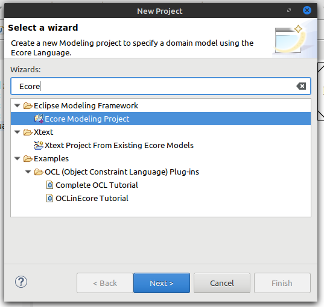
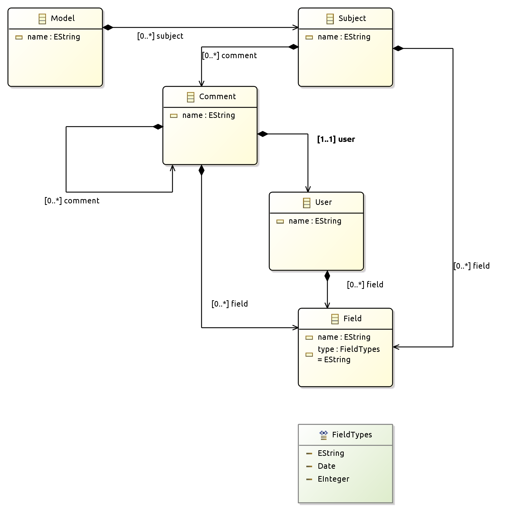
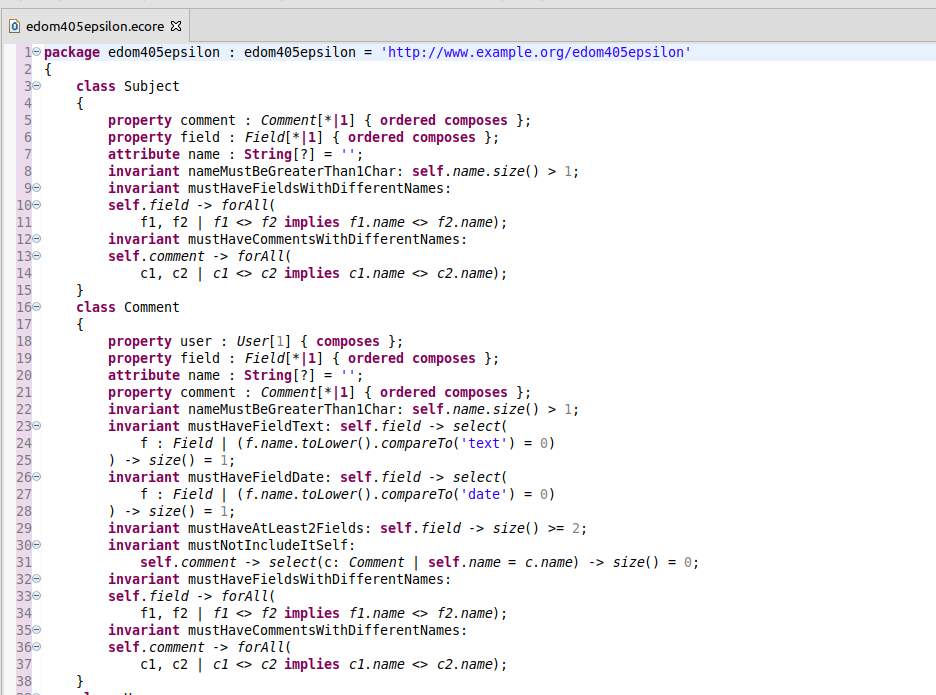
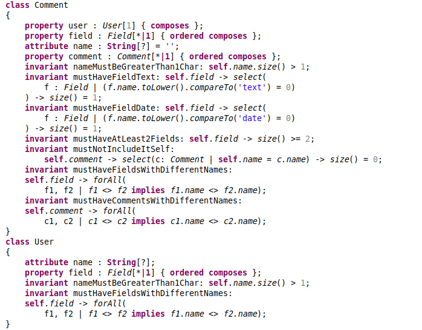
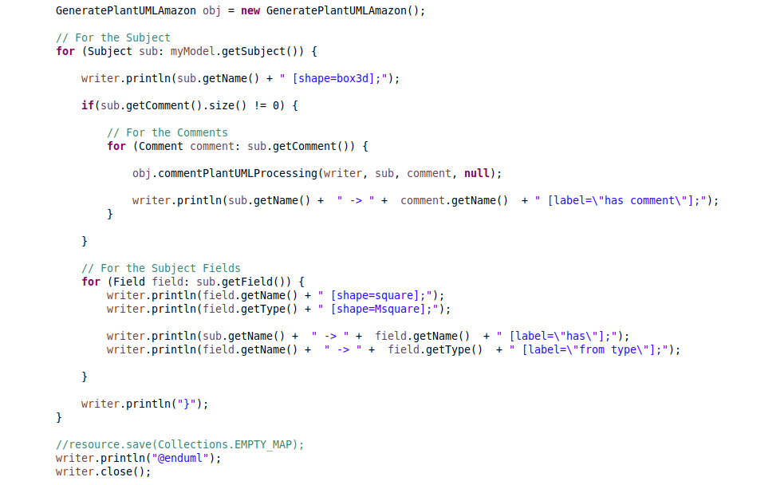
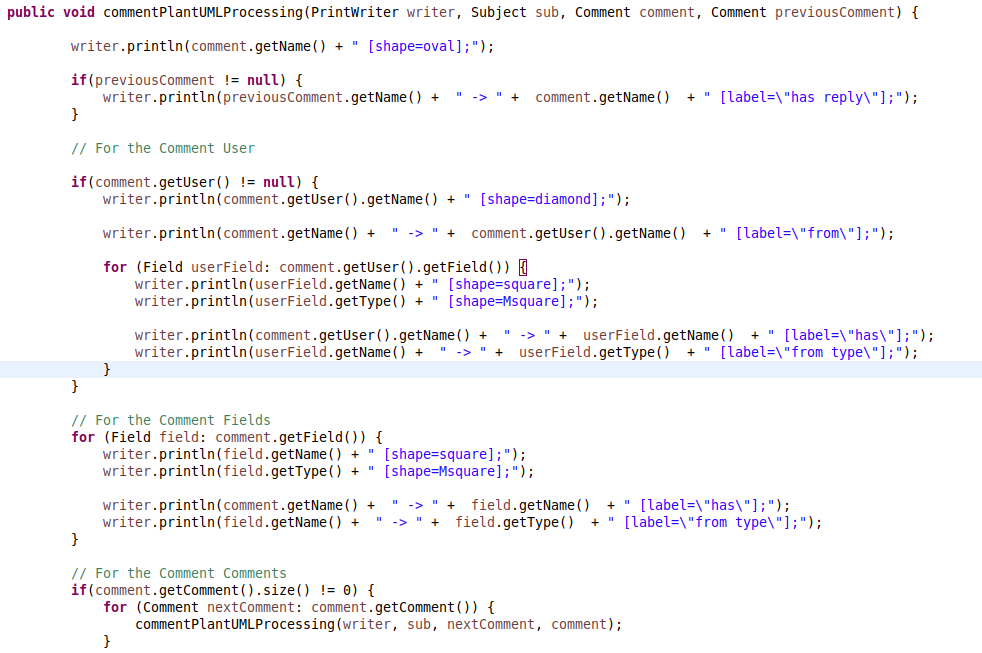
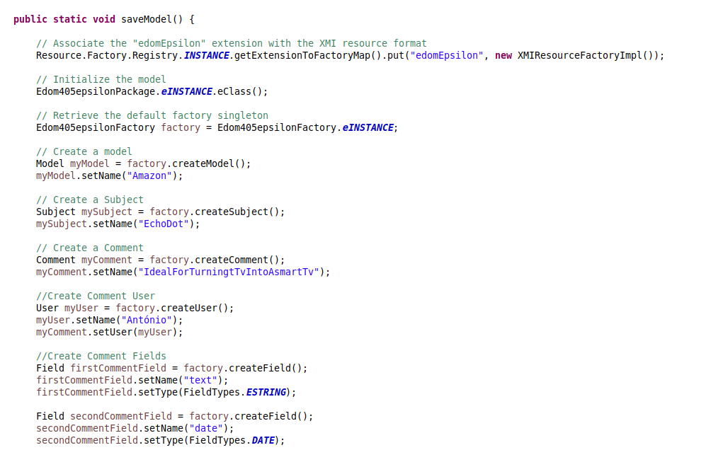
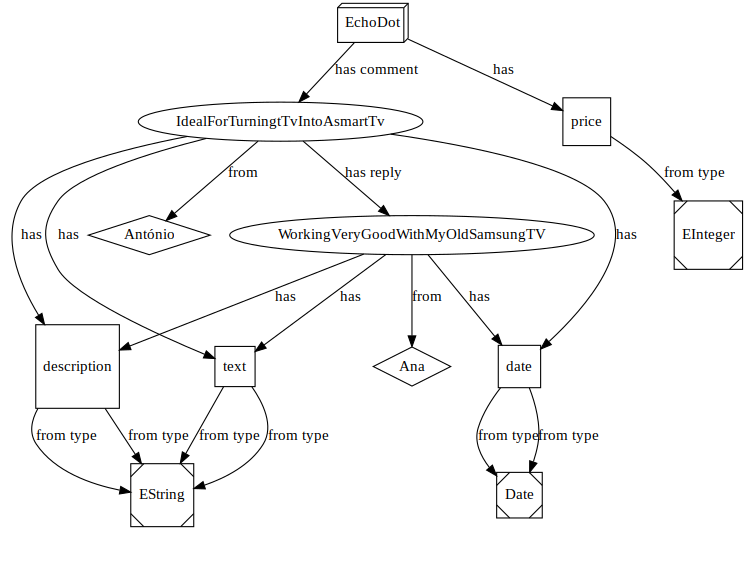

# EDOM Project, Part 1, Tool 3

You should also include in this file the report for this part of the project (only for tool 3).

## Description of the Tool

Epsilon (Extensible Platform of Integrated Languages for Model Management) is a platform for builing consistent and interoperable task-specific languages for model management tasks such:
    - Model Validation
    - Model to model transformation
    - Model to text transformation
    - Model migration
    - Pattern matching

All languages are built on top of a common language for model querying and modification called Epsilon Object Language.

## How to Setup and Install

To install Epsilon, we just need to access the Help tab on Eclipse, go to Eclipse Marketplace and search for Epsilon and install.

## Implementation of the Metamodel

Before implementing the metamodel using Eclipse, we need to create an **Ecore Modelling Project**:

Then we edit the ecore file to design the metamodel using the graphical view in Eclipse:

For this project, we design the below elements:

* Subject
* Comment
* Field
* FieldTypes
* User

Our top concept in the Model is the Subject that represents the highest level for our Models, and will be the meta object for the objects Product, Video and News Article model studied before.

After editing the graphical view in Eclipse, there will be generated some code in the ecore file that can be edited using the **OCLinEcore Editor**

In this Editor, we can change some of the attributes and properties of our metamodel elements as shown in the image above.

## Implementation of Constraints and Refactorings

To implement Constraints for the developed metamodel, the team studied the possible restrictions there was imposed on the model:

1. Every element must have a non null name (nameMustBegreaterThan1Char)
2. Every element that contains fields, should not have duplicated fields(mustHaveFieldsWithDifferentNames)
3. Every element that contains comments, should not have duplicated comments(mustHaveCommentsWithDifferentNames)
4. Every comments needs to have a Field called 'text' (mustHaveFieldText)
5. Every comments needs to have a Field called 'date'(mustHaveFieldDate)
6. Every comments needs to have at least 2 Fields (mustHaveAtLeast2Fields)
7. Every comments cannot include itself (mustNotIncludeItSelf)

After studying the model, the constraints were aplied in the ecore file:

## Implementation of the Visualizations

To create a model visualization, there is a class called GeneratePlantUML (identical to the class use in the EDOM classes) that will generate a plantuml using the model as a base.

## Implementation of Models (instances)

To generate the model (that will be used as input in the GeneratePlantUML), there is the SaveModel class that will generate a example(or the Amazon) model with some elements and properties.

## Execution of Constraints and Refactorings

For our model, there weren't refactorings implemented because we think that the applied constraints obtain the desired rules for the Metamodel.

## Generation/Execution of Visualizations

