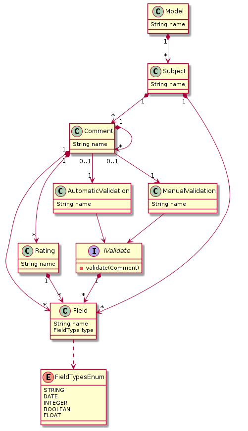

# EDOM Project, Part 2 - Team Report

In this folder you should add **all** artifacts developed for part 2 of the EDOM project, related to team/group work.

**Note:** If for some reason you need to bypass these guidelines please ask for directions with your teacher and **always** state the exceptions in your commits and issues in bitbucket.

Following there are examples of proposed sections for this part of the report (team part).

## Domain Knowledge Obtained from Analyzing the Applications

## Design of the Metamodel

### Changes of Part 1 Model

## Activity 1: Design Concrete Syntax for the DSL

### Graphical DSL 

#### Epsilon/Eugenia
For each metamodel element, the team chose a different graphically representation:

* Subject - for the Subject, we will be using an **oval blue** object;
* Comment - for the Comment, we will be using an **oval red** object;
* Validation - for the Validation, we will be using an **yellow diamond** object;
* Field - for the Field, we will be using a **white square** object;
* FieldType - for the FieldType, we will be using a **green square** object;
* Rating - for the Rating, we will be using a **purple triangle** object;

#### MS Tools
Due to the lack of many geometric shapes to replicate Eugenia's shapes, the default shapes provided by MS Tools were accompanied by the vast colour scheme it also provides. Thus this CRR DSL can provide some kind of colour-coded representation. The colour-code follows these rules:

* Subject - **Blue** Rectangle
* Comment - **Green** Round-Cornered Rectangle
* Validation - **OrangeRed** Ellipse
* Field and FieldType - **Indigo** Circle
* Rating - **Yellow** Circle

### Textual DSL (JetBrains MPS)
For the Textual representation of DSL developed in MPS, the following topics were considered:
 * Model - the Model concept, will be featured at the top of the highlighted DSL (enclosed in red brackets);
 * Subject - is displayed in a table, the top rectangle being the subject's name and fields, with all the childs by vertical;
 * Comment - appear under the Subject statement within your board, after the label '--Comment--' with the own Fields after the label '--Detail--';
 * Field and FieldType - is a name followed by the data type enclosed in a rectangle;
 * Validation - presented after the label '--Validation--', can be automatic or manual;
 * Rating - presented after the label '--Rating--', with Field name and boolean;

 **Note:** The empty DSL should suggest the pretended input.

## Activity 2: Specify Common Features for Applications of the Domain

For the Prototypes, we will be using Java language and we will be developing a console application based in the Amazon, Youtube and Online Newspaper Model.

For all models, there are some common funcionalities:

1. Create Subject
    - The User need to create a subject that will contain a list of comments and a name
2. Create Comment
    - The User need to create a comment that will contain a text review, a rating, a list of validations (manual or automatic, for example) and a list of Comments (for the replies)
3. Create Validation
    - The User need to create a validation that will contain a function that validate the comment (automatic code for the automatic validation, user interface validation for the manual validation)
4. List Comments
    - The User wants to get all the comments from a specific subject so he/she can select a comment to rate/read or add a new comment
5. Add rating to comment
    - The User wants to rate a comment that he selected before
6. Add comment reply 
    - The User wants to add a reply to an existing comment
7. List Subjects
    - The User wants to get all the subjects so he/she can select a specific one

## Activity 3: Implement Prototypes of Applications of the Domain

- **[YouTube Prototype](tool1-mps/readme.md)**

- **[Publico Prototype](tool2-ms/readme.md)**

- **[Amazon Prototype](tool3-epsilon/readme.md)**

## Activity 4: Identify Commonality and Variability in the Code

After analysing all the prototypes developed, we realised that there were some common classes and functionalities that could be generated in the next activity:

* Validation and the two implementations of it: Manual and Automatic Validations
* Model - this would be a abstract class that could be implemented for each specific model. This can give us some default/common methods and variables for all the implementations
* Rating - same as the Model, Rating would be an abstract class
* Subject - same as the Model, Subject would be an abstract class
* Comment - same as the Model, Comment would be an abstract class with some common variables like date, text, list of comments and Rating
* All necessary Controllers - that will have the methods to create, delete or list all the model elements in the application

All other classes that implement or extend all those mentioned above, will be variable classes that may or may not be generated depending on the application used:

* Amazon, Online Newspaper, Youtube (Models)
* StarRating, LikeRating, DoubleRating, ... (Ratings)
* User (it depends from the models itself)
* ProductReview, VideoReview, NewsReview (Comments)

## Activity 5: Design and Implement Code Generation

- **[YouTube Prototype](tool1-mps/readme.md)**

- **[Publico Prototype](tool2-ms/readme.md)**

- **[Amazon Prototype](tool3-epsilon/readme.md)**

## Activity 6: Generate Applications

After generating all the code in the different applications, the generation was tested for the 3 existing models and the necessary code was generated without any problem. This allowed us to understand all the possibilities that this type of Low Code Technologies provide, allowing to generate 3 different applications but with common points, using the same files.