# EDOM Project, Part 2, Tool 1

In this folder you should add **all** artifacts developed for part 2 of the EDOM Project, related to tool 2.

You should also include in this file the report for this part of the project (only for tool 1).

**Note:** If for some reason you need to bypass these guidelines please ask for directions with your teacher and **always** state the exceptions in your commits and issues in bitbucket.

---

## Implementation of Textual Notation for DSL

The JetBrains MPS tool only supports textual DSL's, and its customization is based on **Editors**. In order to make instantiating DSL's more intuitive and easy, **Editors** can be implemented for each **Concept** of the model.
An **Editor** consists of cells, which contain other cells, text, or a UI component. A concept may have no more than one editor declaration (or can have none).

To prepare this activity, the following **Editors** were created:

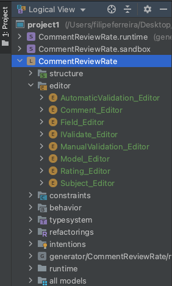

In the image below shows the treatment of **Editors**, in code form it is possible to fill in the schema the attributes that we intend to show of the **Concept** as well as related **Concepts**, we can also insert simple text with CSS type customization. 
The organization of the elements that will be shown in the instantiation of the DSL, consists of the arrangement of the elements in vertical, horizontal or indented structures.

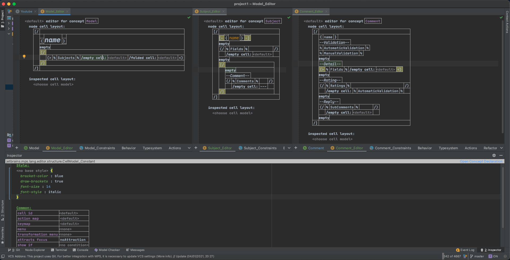

This would be the aspect of DSL in the absence of custom **Editors**:

This is the final aspect with the applicability of the **Editors**, some fields have suggested filling in, in order to make filling in the DSL more intuitive:

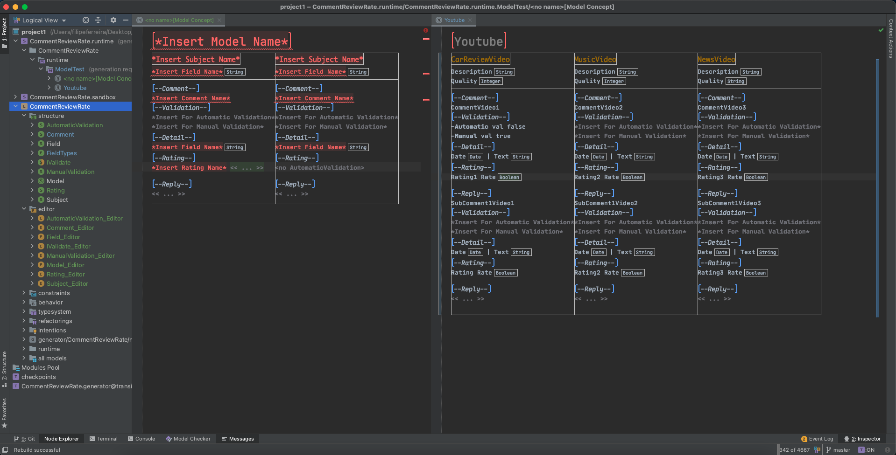

---

## Implementation of Prototype Aplication of Domain

In order to comply with **Activity 3**, a *Java* console application was implemented with the features described in **Activity 4**.

The classes shown in the image below were created:
The *Controller* classes contain the methods with some of the necessary logic implicit in the functionality, while the model is just the entities.
The Main class executes the menus in the **ApplicationUi** class:

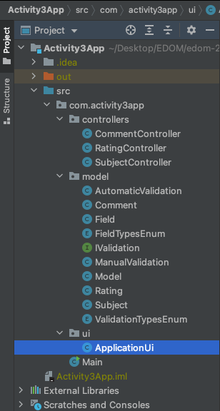

Entities are the data structure on which our business is modeled (Comment and Review).
Example of an entity (Subject):

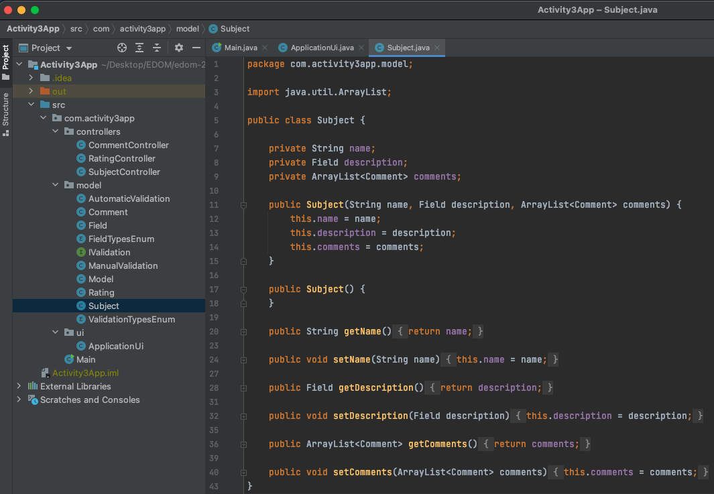

Example of an Controller (SubjectController):

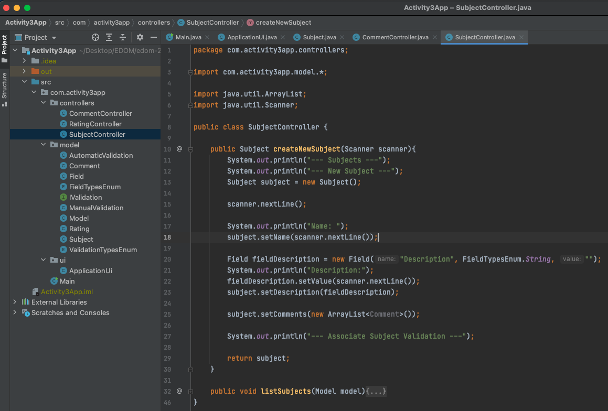

Application interface implementation will be executed by the main class:

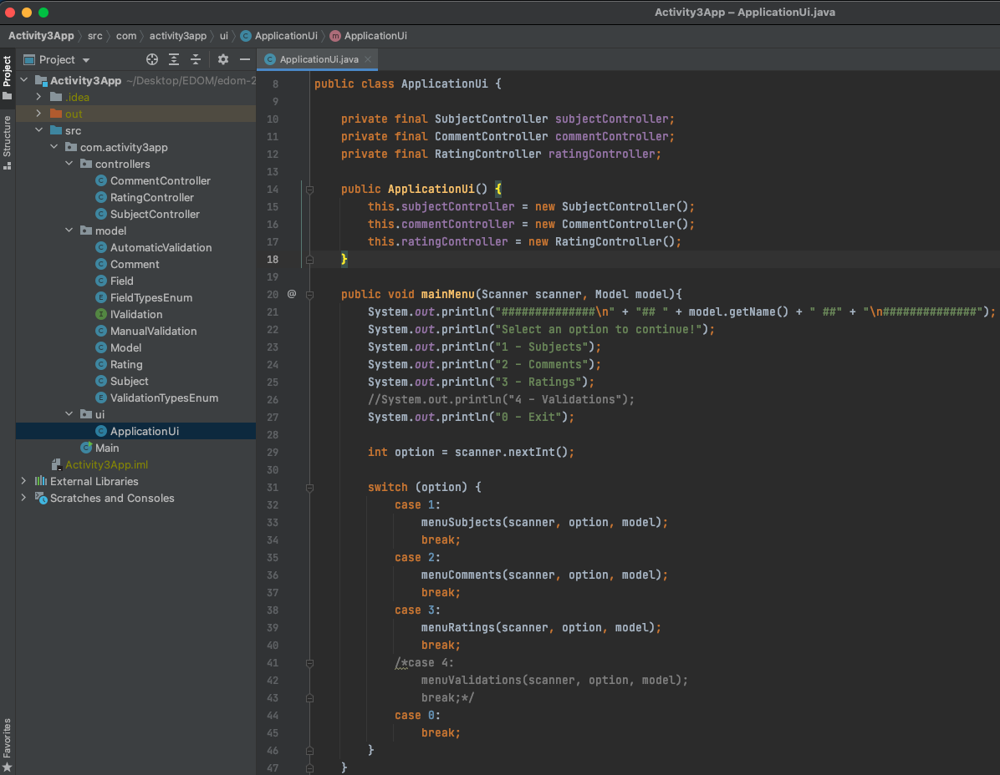

This is an example of running the application, with the creation of a *Subject* and a list of all existing *Subjects*:

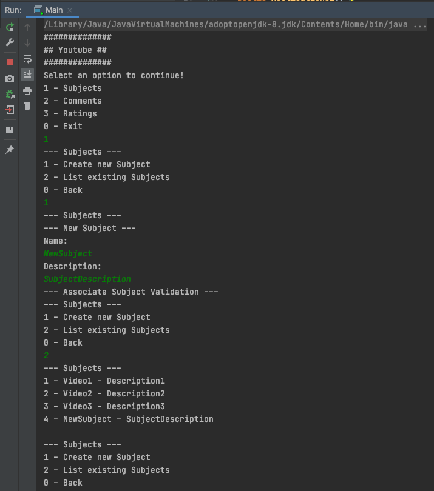

This prototype presents some abstraction in the nomenclature of its constituents so that it can be used for Amazon, Publico and Youtube

---

## Implementation of Code Generation templates (MPS Generator)

For code generation, the MPS Generator was used.
The classes below were developed as templates for the code to be generated.
These templates consist of the declaration of the Java code that will be necessary for the execution of the application, this code generation needs to be modular, since the number of attributes of a class can be dynamic, depending on the elements created in the DSL.

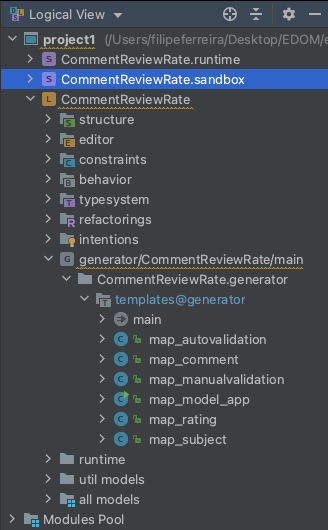

The main configuration consists of defining which concepts will be attributed to a given Java code template.

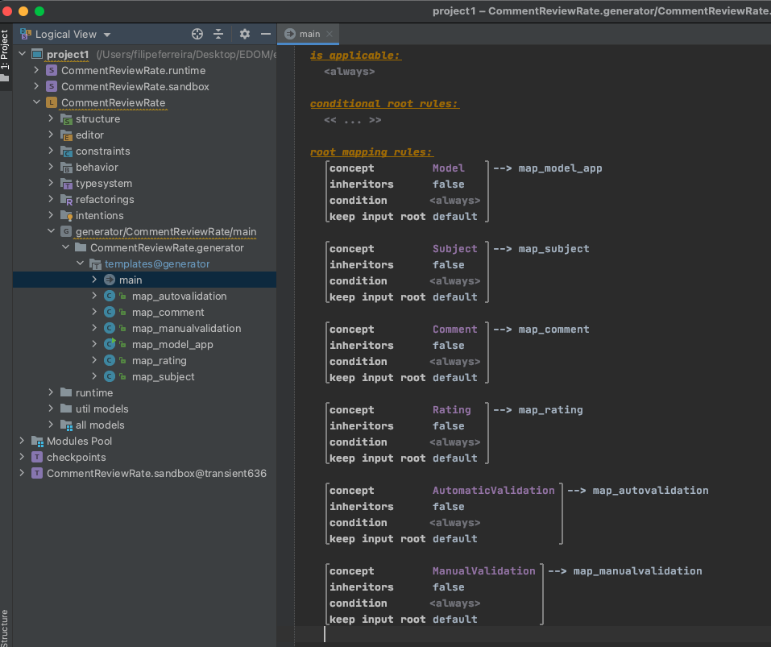

As an example, below in the 'map_example', I have the macro loop for the concepts that it is necessary to iterate depending on the amount of declaration in the created DSL's. 
A subject can have a variable number of **Fields**, and these can vary between the DSL, for this purpose, *$LOOP$* is used to iterate through the different **Fields** of the various **Subjects** and with the *reference macro* it is possible to get the name declared for *Field* in DSL.
The same reasoning is applied for the remaining types of attributes and methods, in order to obtain a customized name according to the filled attribute name:

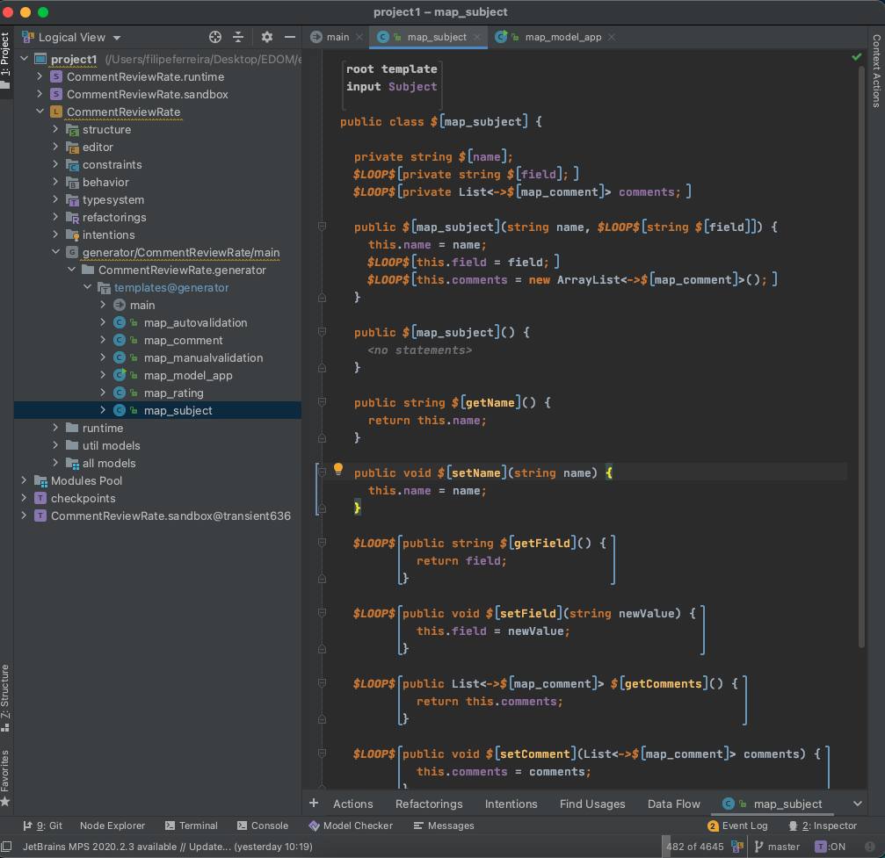

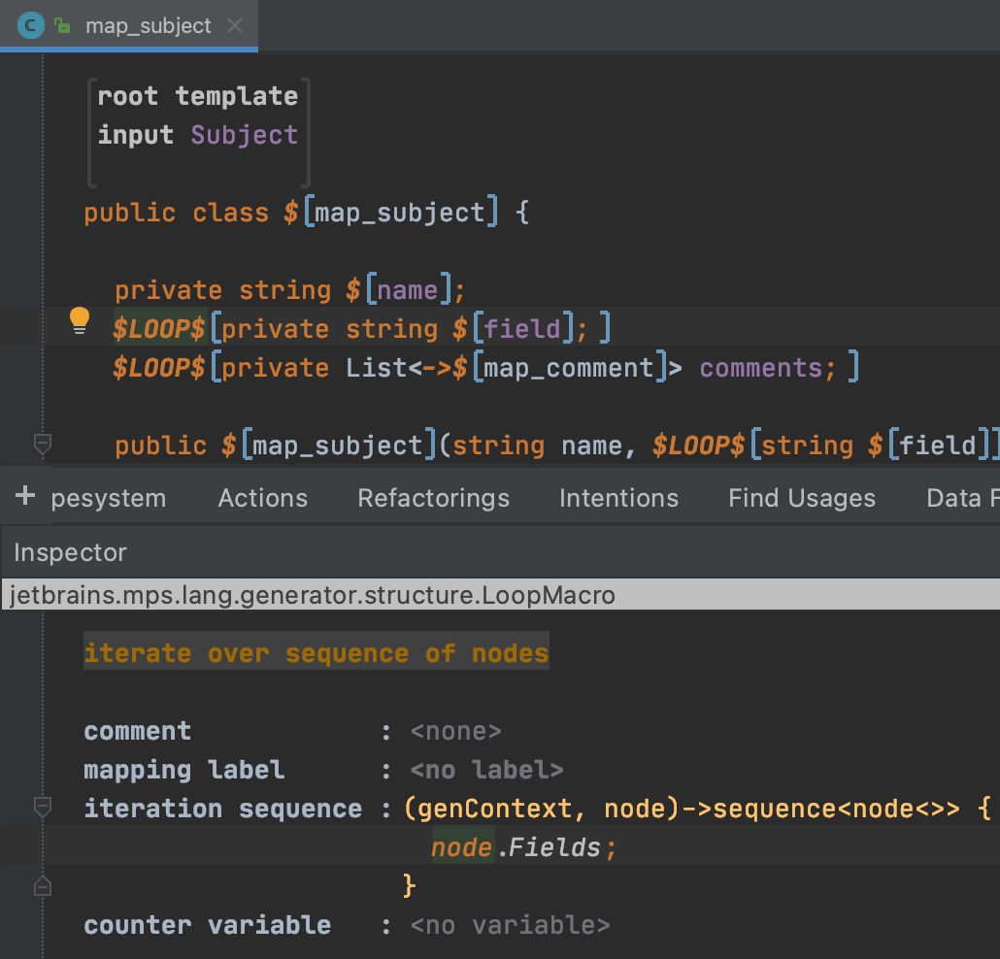

The class obtained by 'map_model' presents the main method so that in the end this class can be executable.
The reference macro ($[sometext]) aims to obtain the concept name filled in the DSL.

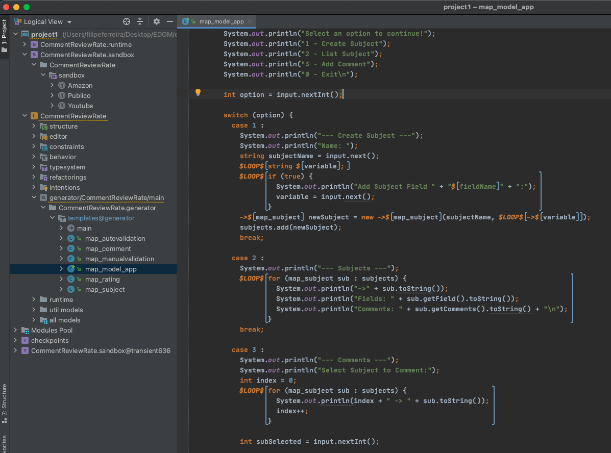

---

## Generation of Applications 

For the realization of the great final objective of the work, DSL's representative of all applications were created (Amazon, YouTube and Publico):

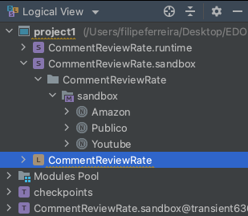

These DSL's were created after the Textual definition of concepts using **Editors** (Section -Implementation of Textual Notation for DSL). The image below shows the DSL's declared and used:

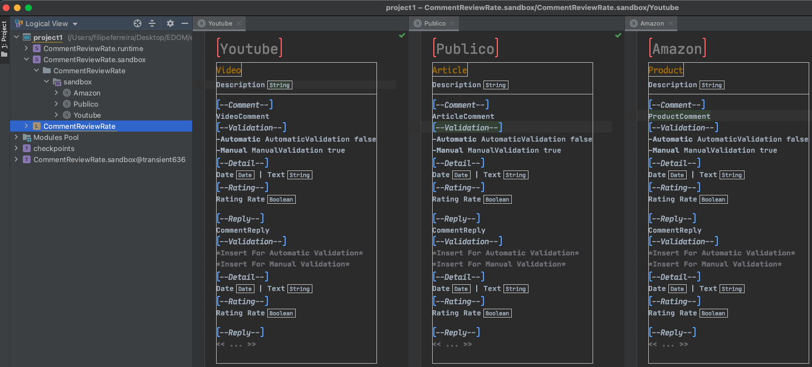

For the code generation to be executed, it is necessary to perform the **Rebuild** of the *solution* that contains the DSL's, previously guaranteeing that the language "CommentReviewRate" has been properly compiled.
The image below shows the execution of the process:

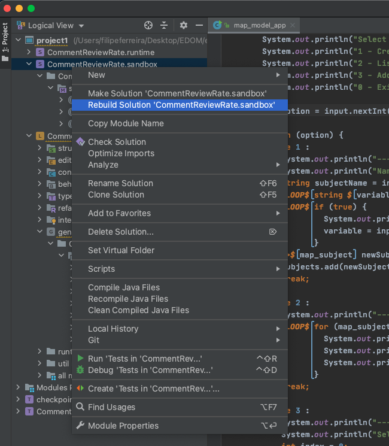

This is the final product of generating the code from the DSL's, which can be found in the 'source_gen' folder contained in the project folder!
They are Java classes, properly filled with the logic implemented in the templates developed and demonstrated in the previous section.
For each DSL's, a class is generated with its own main method (with name equals to DSL name), functioning as separate applications but consuming and supporting the same classes.

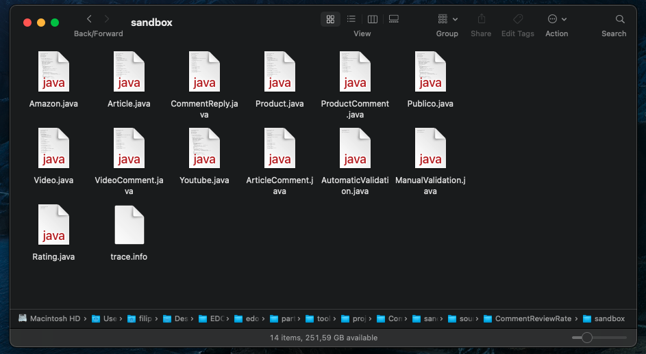

Finally, to execute the generated artifacts, a Java project is created with an IDE capable of supporting Java. In this case IntelliJ was used, as well as MPS, they are JetBrains tools. It is only necessary to copy the generated artifacts to the project folder to be executed and ensure the correct name of the package, so as not to encounter problems in *imports*.

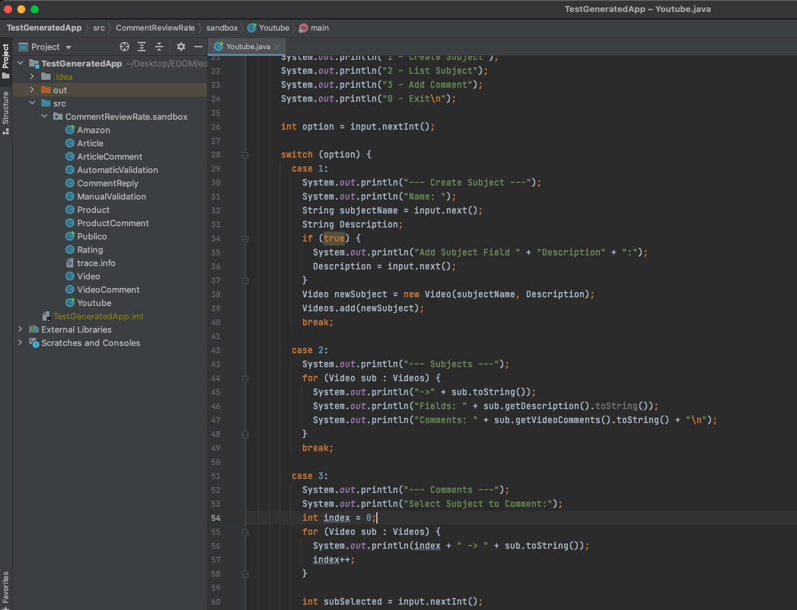

We now have the Youtube, Public and Amazon class that can be executed by raising the performance of our applications generated based on DSL's:

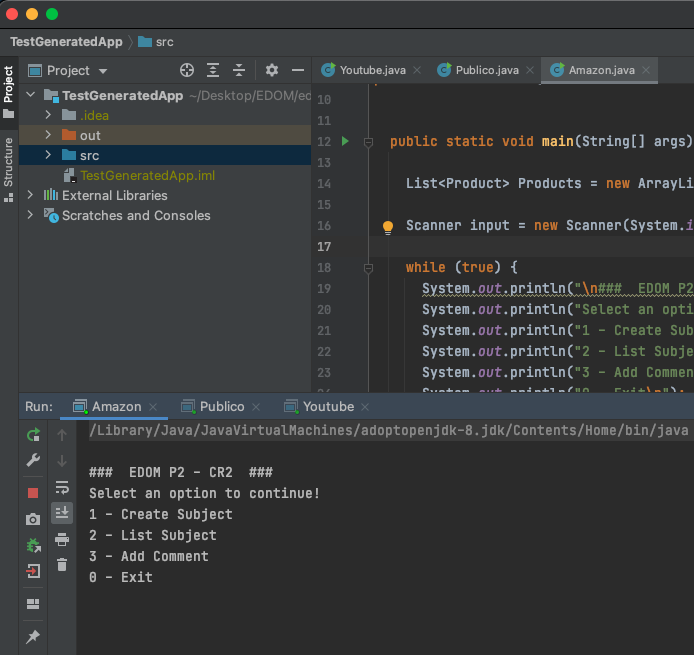

Some challenges were encountered during the development of these last two sections (Implementation of Code Generation templates and Generation of Applications).
- The IDE provided by JetBrains MPS is not very user friendly when writing and declaring the algorithms, sometimes requiring extra and redundant work;
- The syntax used by the JetBrains MPS Generator is not easy to interpret and learn, and with low online support;
- Sometimes, when generating the code, errors arise that are not easy to interpret;
- The fact that templates are only "translated" if their **Concept** is instantiated in DSL.

