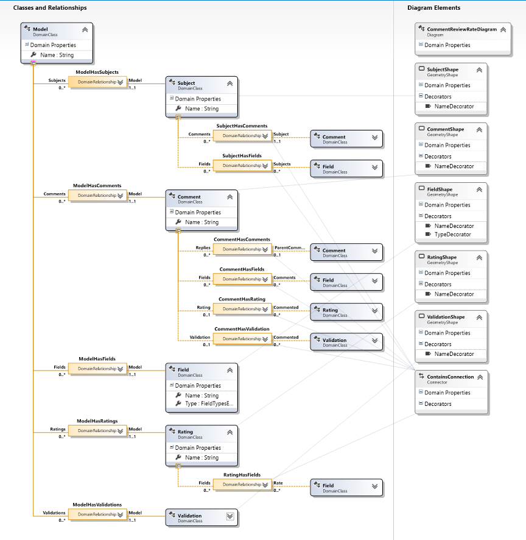
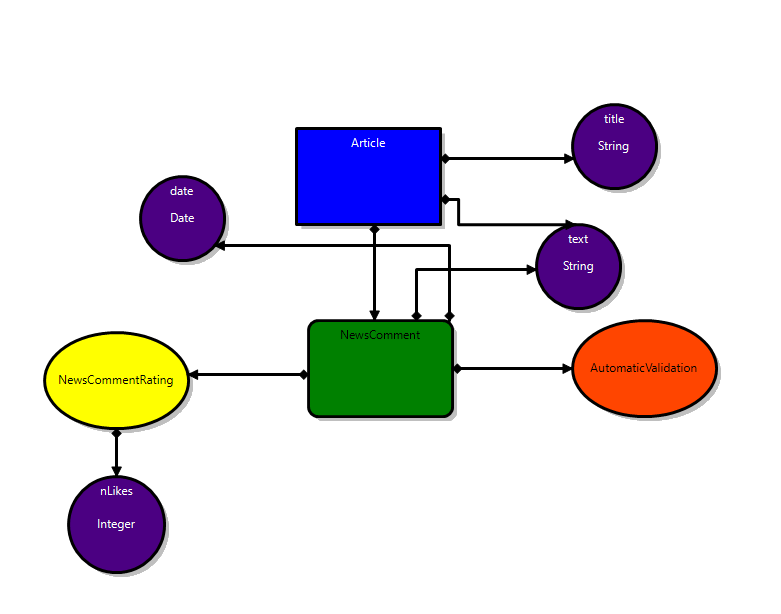
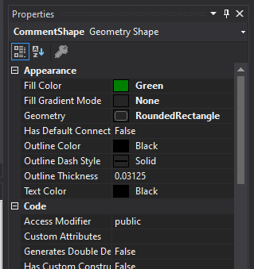
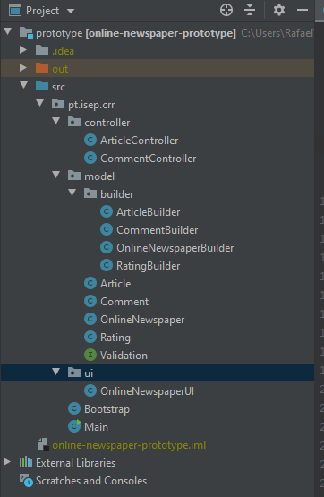
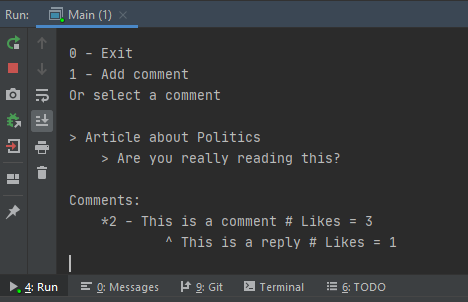
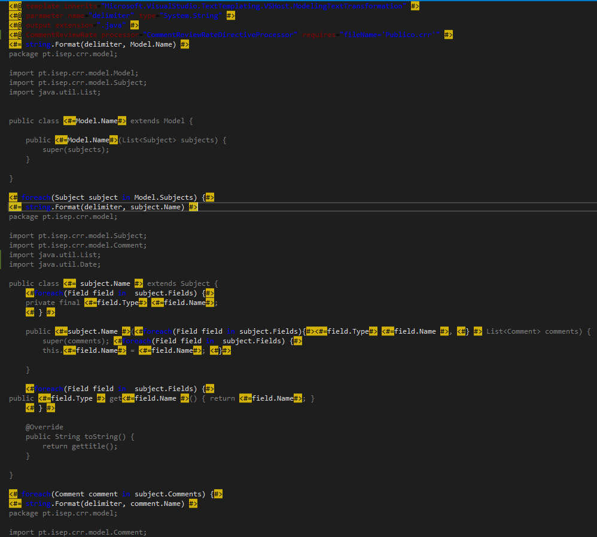
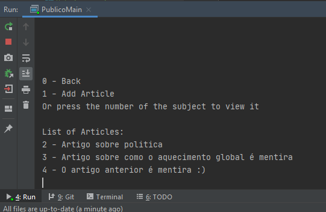
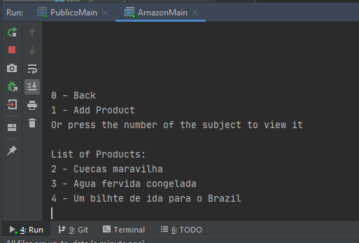

# EDOM Project, Part 2, Tool 2

In this folder you should add **all** artifacts developed for part 2 of the EDOM Project, related to tool 2.

You should also include in this file the report for this part of the project (only for tool 2).

**Note:** If for some reason you need to bypass these guidelines please ask for directions with your teacher and **always** state the exceptions in your commits and issues in bitbucket.

## Description
This section contains the report of the Project Assignment #2 : DSL and Code Generation relative to the Microsoft Visual Studio's Modeling SDK tool.

## Activity 1: Design Concrete Syntax for the DSL

As previously known, MSDK allows the creation of a DSL so no transformation from metamodel to DSL was needed and the model from the previous iteration was used from the start of Part 2.

Only some aspects were changed like mentioned in the previous section which resulted in the following DSL:

A graphical syntax was designed following a colour code like it is said in the base README file, and, using _Publico_ as a model for this representation here's how an instance of the DSL looks following the syntax defined:

This was done by simply altering each GeometryShape mapped to the DomainClasses in the DSL properties, bellow is the properties of the CommentShape used to represent the Comment DomainClass in the model:

## Activity 3: Implement Prototypes of Applications of the Domain

For this activity a prototype replicating the _Publico_ Online newspaper website was made writing a simple Java console application. This prototypes allows the user to:

- View Articles
- Create Articles
- View Article's Comments
- Comment on an Article
- View Replies of Article's Comments
- Rate a Comment (This is simpler than it sounds, it's just increasing the number of likes a Comment has)

 The prototype uses the Builder Pattern, however that implementation wasn't applied to the prototype involving code generation due to complexity reasons. The prototype has the following strucrute:

 

 And a sample of this prototype being used is present bellow:

 

## Activity 5: Design and Implement Code Generation

With MSDK to generate code you must use T4 Templates which, with the Modeling SDK, allow the user to write templates based on a certain model. More info on this [link](https://docs.microsoft.com/en-us/visualstudio/modeling/accessing-models-from-text-templates?view=vs-2019).

This is done easily by creating a `.tt` file, set the extension to `.java` and type away, however after minutes of thinking how to tackle code generation, this method wasn't possible and wan't going to be so easy. Simply because generating like this gives the user only 1 generated file per 1 text template file and for this to work I would need 1 text template file to generate more code files.

Luckily, MSDK documentation was prepared for this and following this [section](https://docs.microsoft.com/en-us/visualstudio/modeling/accessing-models-from-text-templates?view=vs-2019#generating-multiple-files-from-a-template) a solution was implemented. This solution basically requires generating a _loooong_ file with delimiters (file with a `.t4` extension) and then one `.tt` file that reads the giant generated file and splits them by the delimiter defined.

In my case, I made 3 big file templates:
- To generate all **Model** classes
- To generate the **ApplicationUI** class
- To generate the **Main** class (this one is not so big but was needed)

The ApplicationUI and Main templates didn't have to follow the same process however defining the output path is something that this solution brings and simple `.tt` templating doesn't, which is why this method was used on everything.

I didn't feel the need to generate controllers as through my prototype all they did was access Model and Subject objects and as they are abstract no generation was needed. The ApplicationUI was the trickiest to build and required me to let go some of the features but was done despite that. The features lost was having multiple Subjects in one Model, this will only work if you only have 1 Subject in any Model and the Rating system, everything was ready for it with interfaces and all, but was too complex to implement when thought about.

Bellow is a snippet of the `Model.t4` file used to generate all the Model classes for the application:

*Note: This isn't the normal look of a `.t4` file, I installed the Devart T4 extension to have syntax highlighting to facilitate my work.*

## Activity 6: Generate Applications

For the last activity I was able to create a model of my colleagues scenarios (Amazon and Youtube) creating the files `Amazon.crr` and `Youtube.crr`. I then changed manually the fileName of each `.t4` file to use Amazon's or Youtube's model instead of Publico and clicked Build > Transform all T4 Templates which created all the classes needed to run the application.

Before any advancements, everything was ready with just the generation because before all that I created a simple Java project at the same level which had in the `src` folder the common implementations agreed to the team: Comment, Model, Subject, etc. as well as the controllers as they weren't generated in my solution. Then, in the `*Splitter.tt` files (the template files that will split the big files as mentioned before) I added the output path to be the `src-gen` of the Java project created and (in IntelliJ) I marked the `src-gen` folder as a *Generated Sources Root* which allowed every file there to be recognized and not cause problems during the Application's execution.

With all of them generated, the project will look like this:

Here are samples using Publico model vs Amazon Model:

As we can see the applications are very similar and certain keywords will be different across the application when using different models. Another limitation of this development is how it would be hard to generate the ApplicationUI to be aware of it being a slightly different model and use more options, for example, in the Youtube model the Subject (Video) has a Date, and that is present in the Applicatio, however, it's not presented to the user, a custom implementation would have to be made. An idea after developing this work would be having the ApplicationUI abstract with some implementations and let the user extend it and have a custom implementation of each method for example a different mainMenu or a different showSubjects method).