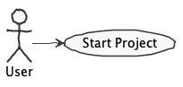

# Repository for Project 3 (Individual)

The goal of this repository is to serve as a template for Part 3 of the project developed during the EDOM course of the MEI Master Program, edition 2020/21.

**Please follow the instructions of the teachers of your course because they will always prevail over what is stated in this readme file.**

## Folders for Each Tool

The projects for each tool should be inside a specific folder (i.e., folders **eclipse** and **tool**). Inside these folders you should create subfolders for each assignment (eg., Modeling, Model Constraints)

**Note:** If for some reason you need to bypass these guidelines please ask for directions with your teacher and **always** state the exceptions in your commits and issues in bitbucket.

## Documentation
It is mandatory to produce documentation for all your Assignments. The documentaion **must** always be produced in readme.md files! **You may use this readme file**

These readme.md files use markdown. You may find further documentation about markdown in [Markdown](https://en.wikipedia.org/wiki/Markdown)

### Producing Technical Diagrams

This repository supports the generation of PlantUML diagrams using Gradle.

The PlantUML diagram files must be included in the **diagrams** folder. The file build.gradle and the folder buildSrc is where the gradle support for PlantUML is located.

To generate diagram simple execute "./gradlew" (or "gradlew.bat" in Windows) in a terminal (having the root of the project as the current folder).

The repository includes an example of a PlantUML diagram in diagrams/usecase.puml.



## Issues and Commits

Each student will have a fork of this repository in bitbucket.

It is a good practice to create an **Issue** in bitbucket for each task that you individually will be developing.

Each commit in your repository should always make a reference to the corresponding issue.

You should also close the issue when the task is finished.

For each deadline/submission of your task/project you should also create a tag in the repository.

## Report

Following are example sections of the report.

### Eclipse Modeling Tools

This package contains framework and tools to leverage models : an Ecore graphical modeler (class-like diagram), Java code generation utility for RCP applications and the EMF Framework, model comparison support, support for XSD schemas, OCL and graphical modeler runtimes. It includes a complete SDK, developer tools and source code.

#### How to Setup and Install

1. Download and open Eclipse installer

2. Search and select 'Eclipse Modeling Tools' option

3. Press install and wait patiently

*Note: Due to having several JDK versions installed if your JAVA_HOME environment variable is pointing to a version below 11 you will need to:*

4. Open ecplise.ini file (located inside Eclipse installation folder) and add the following lines above '-vmargs':

```ini
-vm
<JDK_11_Or_Higher_Folder_Path>\bin
```

### Demonstration Case

#### Modeling

#### Model Constraints

#### Model to Model Transformations

#### Domain-Specific languages

#### Model to Text Transformations

### Industry Cases

#### Case 1

Model-Driven Engineering
- Principles
  * For instance, how they address "models+transformations=software"?
- Use Cases
  * For instance, it is a forward engineering case or a reverse engineering case?
- Model-Driven Architecture (MDA) and UML
  * e.g, Are MDA or any of its principles followed?
  * e.g., How does the case relates to UML?
- Integrating MDSE in the Development Process
  * e.g, How does the case relate to Domain-Driven Design?
  * e.g., How does the case relates to Tests oriented approaches (e.g., Test-Driven Development)?
  * e.g., How does the case relates do Agile approches?
- Domain-Specific Languages
  * e.g., Are there DSLs in the case? How can we characterize the DSLs?
- Tools used
  * e.g., What MDE tools are used in the case? How they relate to the ones in the EDOM course?

Software Product Lines
- e.g, Is there a Domain Engineering process in the case?
- e.g., Is there an Application Engineering process in the case?
- e.g, Is there Product Line Management process in the case? How to management and technical aspects integrate?
- e.g., Are there Variability Models involved in the case?

#### Case 2
...

#### Case 3
...

#### Case 4
...
