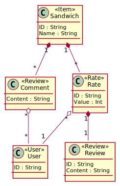

# EDOM Project, Part 1 - Team Report

In this folder you should add **all** artifacts developed for part 1 of the EDOM project, related to team/group work.

**Note:** If for some reason you need to bypass these guidelines please ask for directions with your teacher and **always** state the exceptions in your commits and issues in bitbucket.

Following there are examples of proposed sections for this part of the report (team part).

## Domain Knowledge Obtained from Analyzing the Applications

### AliExpress

- The subject of this application are products
- Customers can review and rate products.
- A cutomer needs to purchase the product to be able to rate and review it.
- A review is composed of text and a rate in the range 0-5, and may also include pictures in attachment
- To review you must also rate the product, but you may rate the product without leaving a review
- Customers may also attach pictures to their review


### Google Maps

- The subject of this application are places
- Users can review and rate places, even without visiting them
- A review is composed of text and a rate in the range 0-5, and may also include pictures in attachment
- To review you must also rate the product, but you may rate the product without leaving a review
- Users may also attach pictures to their review


### Gorgeous Sandwich

- The subject of this application are sandwiches
- Customers can comment, review and rate sandwiches
- A review is composed of text and a rate in the range 0-5
- Any user can comment a sandwich
- A user needs to purchase the sandwich to be able to rate and review it.
- To review you must also rate the sandwich, but you may rate the sandwich without leaving a review
- Customers may also attach pictures to their review


## Design of the Metamodel


## Constraints and Refactorings

### Constraints


### Refactorings


## Metamodel Graphical Representation

### Domain Model

- Item
  - Class element with <\<Item\>> tag above the Item's name
- User
  - Class element with <\<User\>> tag above the User's name
- Comment
  - Class element with <\<Comment\>> tag above the Comment's name
- Review
  - Class element with <\<Review\>> tag above the Review's name
- Rate
  - Class element with <\<Rate\>> tag above the Rate's name
- Attribute
  - Field in the referenced model's element
- DataType 
  - Field's data type
- ApprovalProcess
  - Class element if an approval process is defined
- ApprovalStep
  - Class element if an approval step is defined

#### Example generated code

```
@startuml

class Item <<Item>> {
    ID : String
    Name : String
}

Item "1" *-- "*" Rate

class User <<User>> {
    ID : String
}

class Rate <<Rate>> {
    ID : String
}

Rate "1" *-- "1" Review 
Rate "*" o-- "1" User

class Review <<Review>> {
    ID : String
    Content : String
}

Review "1" o-- "1" ApprovalProcess 

class ApprovalProcess{
    ID : String
}

class ApprovalSteps{
    ID : String
}

ApprovalProcess "*" o-- "1..*" ApprovalSteps 

@enduml
```

#### Example Diagram


## Presentations of Models (instances)

### AliExpress


### Google Maps


### Gorgeous Sandwich

