# EDOM Project, Part 1, Tool 1

In this folder you should add **all** artifacts developed for part 1 of the EDOM Project, related to tool 1.

You should also include in this file the report for this part of the project (only for tool 1).

**Note:** If for some reason you need to bypass these guidelines please ask for directions with your teacher and **always** state the exceptions in your commits and issues in bitbucket.

Following there are examples of proposed sections for the report.

# JetBrains MPS (Meta Programming System)

## Tool description

MPS is a language workbench that has the purpose to design domain-specific languages (DSL) and it helps users to create their own domain-specific language.

## How to Setup and Install

The installation and setup is pretty easy, we have to download this IDE from [here](https://www.jetbrains.com/mps/download/) and install in our computer.  
After following the installation wizard we have our MPS IDE ready to use.

## Implementation of the Metamodel

When a project is created with "Create sandbox solution" checked we will have two solutions: Sandbox (Marked as "S") and Language(Marked as "L"). Language solution it's where we develop our language and "Sandbox" it's where we can instantly test by writing sample applications.
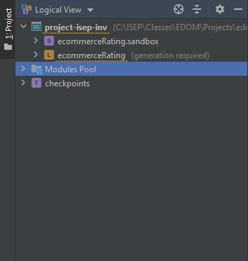

Now to implement our metamodel we need to create "Concepts" inside "structure". Concept can implements INamedConcept interface to have "name" as property. For "children" we have all connections and it's cardinality.(Composition)  
The concept can use references too, it means, that can reference another concept instead create a new one (Aggregation). Example: Item can have one "Comment", but "Comment" concept must be already created on root model.
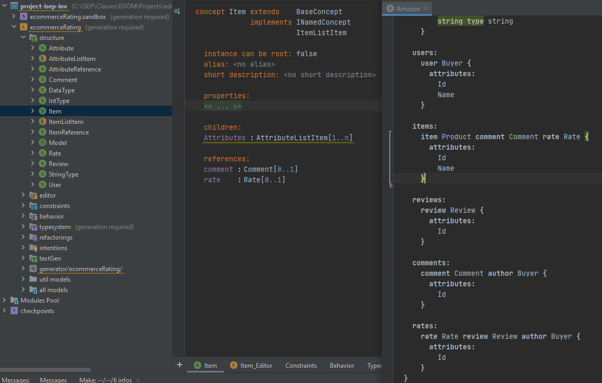

Instead using "reference" field we can use what's called "Smart-reference" in MPS. With this MPS can check concepts already created on model root instead create new one. For this we need to create a new "Concept" that will extends our main "Concept" and on "references" we add our main "Concept"
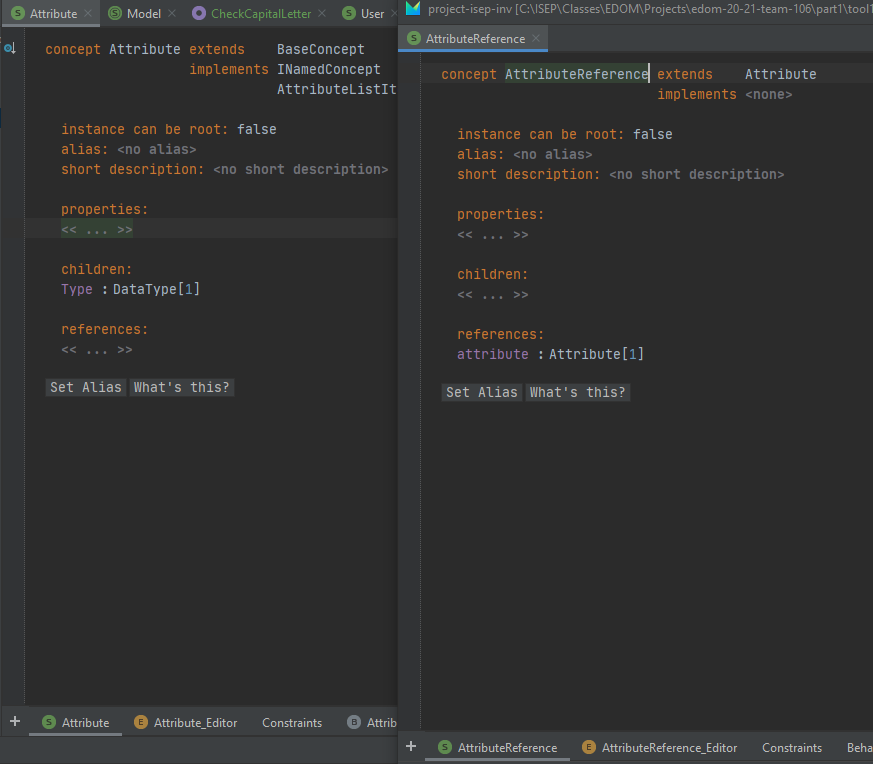

But when we need multiple references, this solution will not work because instead searching for the existing models on root model it will prompt a new model in our editor (Sandbox).  
MPS does not support 1..N references yet.  
Example: Our User can have more than one Attribute
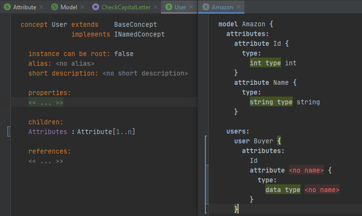

To overcome this we need to create a new Interface to be implemented in our Concept to be referenced and we also need to change the children of the Concept that wants to reference.
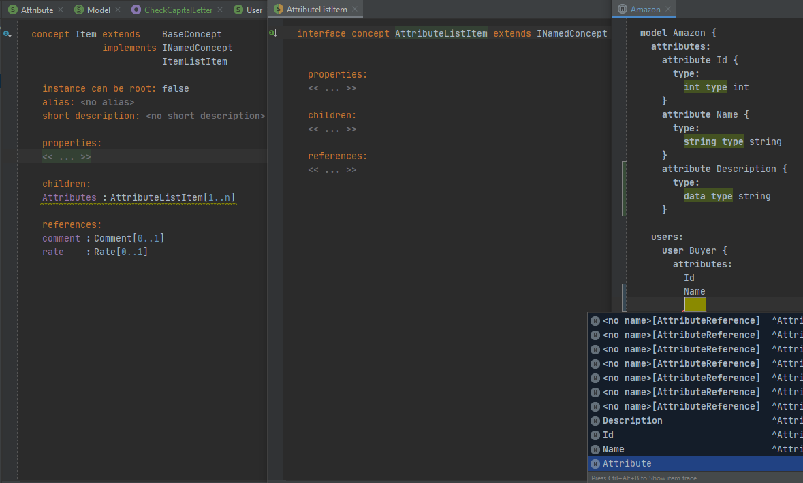

## Implementation of Constraints and Refactorings

We have two methods to implement constraints. The first one is adding a Concept Contraint. For this we need to select "constraints" and create a new one. Inside this we have to select which Concept we want to apply this constraint and MPS will give us some options. For this demonstration we will apply a constraint for Concept properties. We need to specify the property that we want to validate and apply the validation logic.
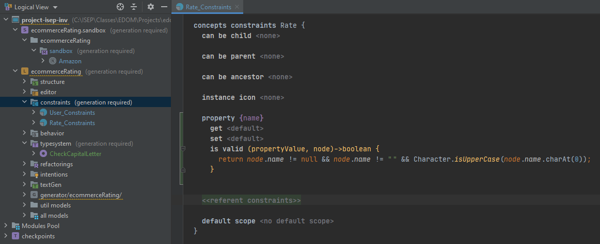

Another method is to add a "Checking Rule" . For this we need:

- Right click on "typesystem";

- Choose "Checking Rule" option;

- Choose a name for the rule;

- "applicable" for concept and choose the Concept that you want to add this rule;

- On "do" write the rule;

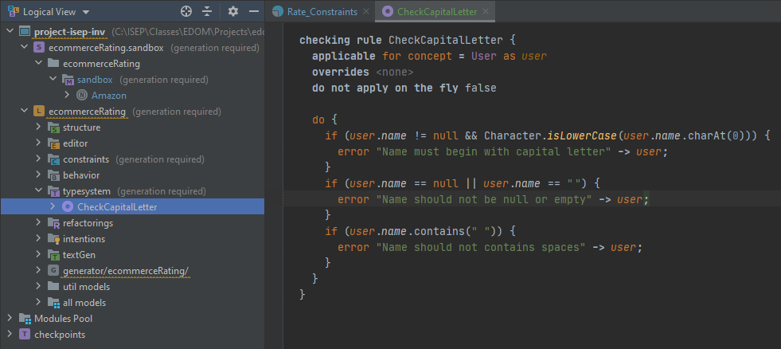

The implementation of refactorings was created using "hints", by giving the user the option to apply the refactorings. For this we need:

- Right click on "Intentions";

- select option "Intention"

- On the new intention created, select the Concept we wanted and on "Execution" method we should apply the refactorings;

## Implementation of the Visualizations

To implement visualization we need to create a "textGen". These are the steps to create a file with .puml extension where we will create our domain model:

- Right click on "textGen";

- Choose "New" -> "Concept Text Gen";

- Inside textGen we can specify our concept that we desire to apply this generation;

- You can also choose the name for your file, path to be saved, extension and encoding;

- On (node)->void{} method it's where we write our transformation.

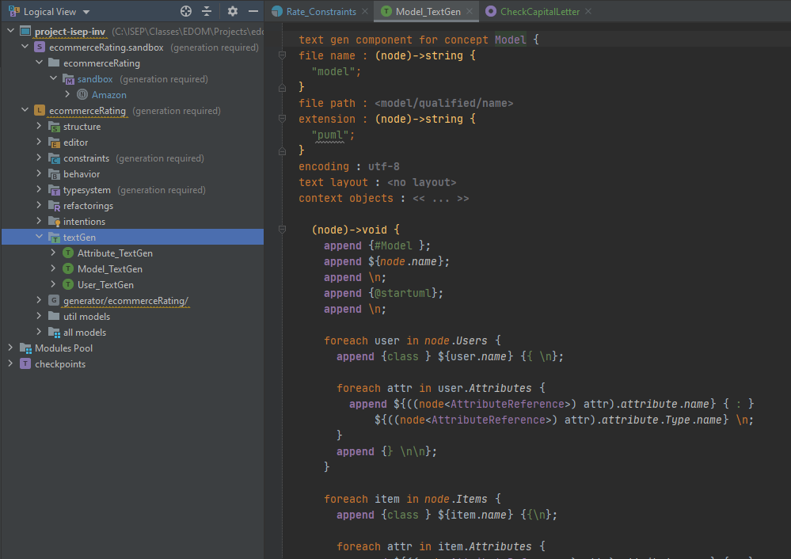

## Implementation of Models (instances)

Since the begining of the project creation, was added the option "Create sandbox solution" and here is where we implement our models. On sandbox we can only add models that concepts were marked as "Root".

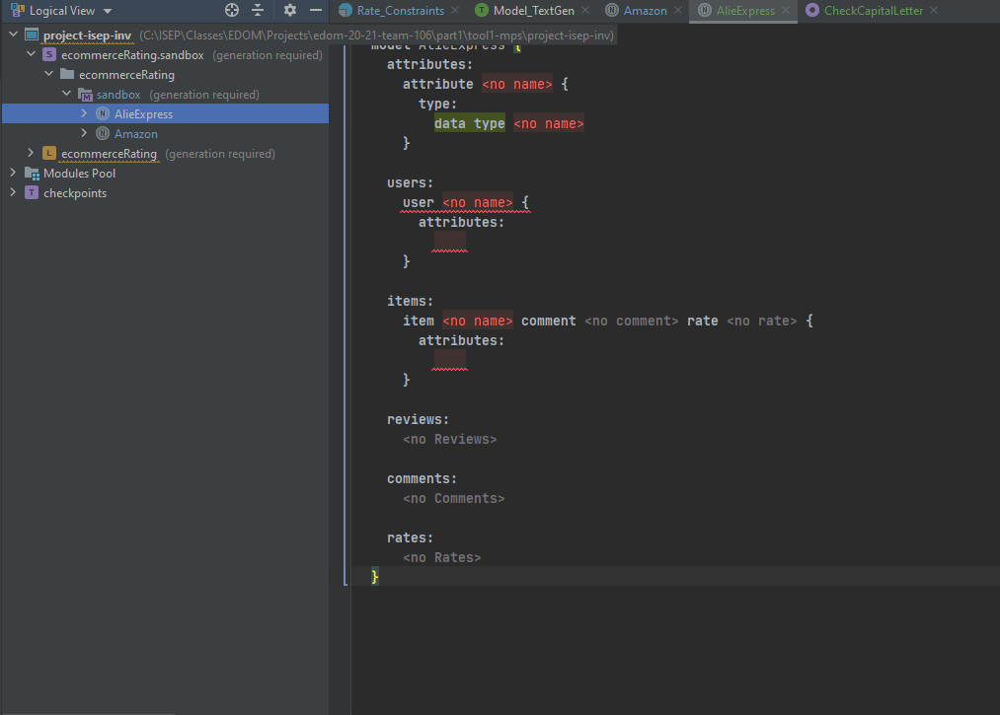

The image above you can see the creation of models. This sandbox shows you the available models you can create inside you root model. We can change how models are displayed by creating Editors for each concept. These editors allow us to change how models are displayed to be more intuitive and productive.

To create these Editors we just need:

- Right click on "editor";

- Choose "New" -> "Concept Editor";

- On "editor for concept" wevchoose the Concept we want;

- On "node cell layout" it's where we apply the layout we want to present on sandbox;

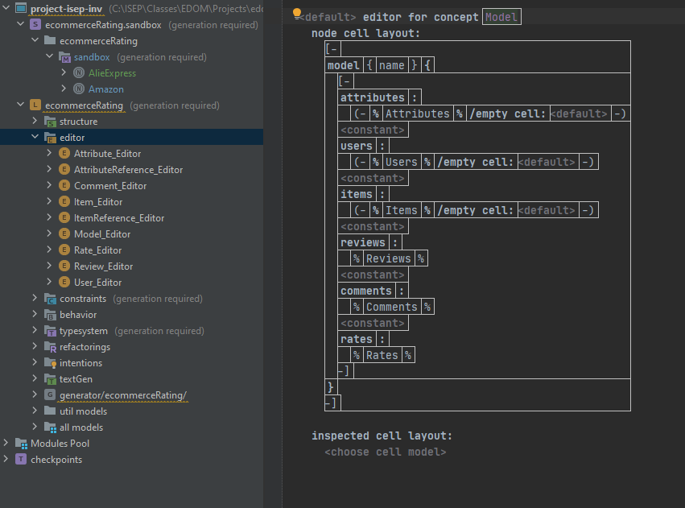

## Execution of Constraints and Refactorings

The constraints are applied on the fly.  
To refactoring our model, it will popup a light bulb on the model that needs to be modified and we need to select the desired modification. 

## Generation/Execution of Visualizations

To check generations we just need to right click in our model root on "sandbox" and select "Preview Generated Text".
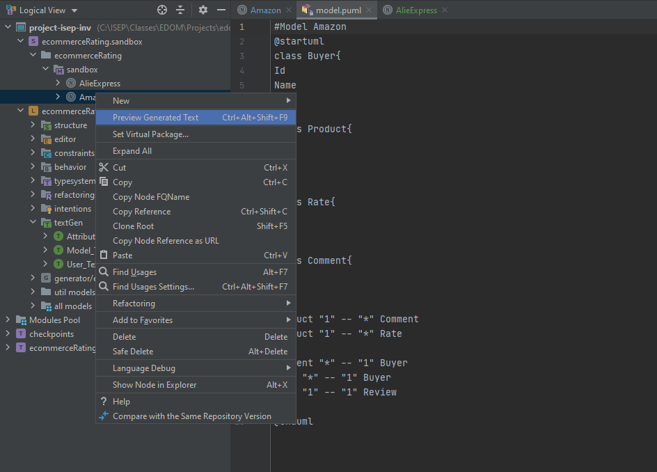
