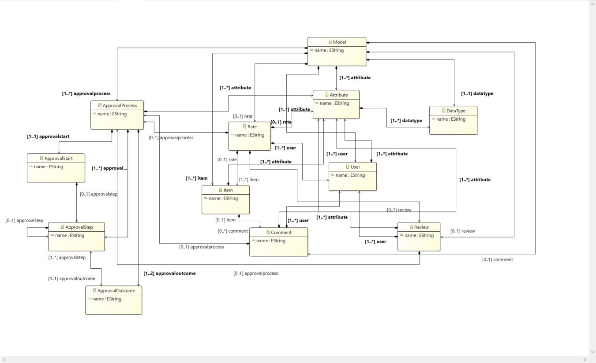
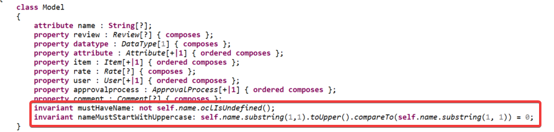
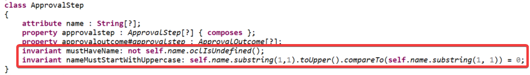
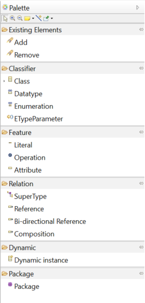
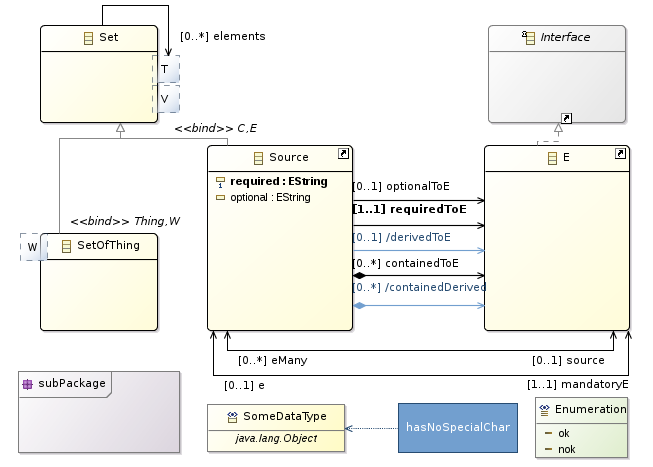

# EDOM Project, Part 1, Tool 3

## Description of the Tool

Eclipse Epsilon

Eclipse is an integrated development environment (IDE) used in computer programming. It contains a base workspace and an extensible plug-in system for customizing the environment. Eclipse is written mostly in Java and its primary use is for developing Java applications, but it may also be used to develop applications in other programming languages via plug-ins, including Ada, ABAP, C, C++, C#, Clojure, COBOL, D, Erlang, Fortran, Groovy, Haskell, JavaScript, Julia, Lasso, Lua, NATURAL, Perl, PHP, Prolog, Python, R, Ruby (including Ruby on Rails framework), Rust, Scala, and Scheme. It can also be used to develop documents with LaTeX (via a TeXlipse plug-in) and packages for the software Mathematica. Development environments include the Eclipse Java development tools (JDT) for Java and Scala, Eclipse CDT for C/C++, and Eclipse PDT for PHP, among others.

## How to Setup and Install

The setup starts by going [here](https://www.eclipse.org/downloads/packages) pressing download on Eclipse IDE for Java Developers.
After just keep pressing next until you get to the extra modules windows in which you pick Modeling package and the DSL one.

## Implementation of the Metamodel

Metamodel implementation on epsilon requires external packages.

Package 1 - EMF Core
Package 2 - OCL Editor

Both packages required the use of Eclipse marketplace. Just searching by their names was enough to find them. After the download the 1st step was to design the metamodel on the project.aird file.

Using the resources provided by EMF Core package we designed this metamodel.



Epsilon automatically processes the file and keeps updating the project.ecore file. Which we will use to add Constraints.

## Implementation of Constraints and Refactorings

After the metamodel design is finished we started by adding constraints.
As previously stated in the global report some of the restraints are:

- Names cannot be null
- First letter must be upper case

```java
invariant mustHaveName: not self.name.oclIsUndefined();
invariant nameMustStartWithUppercase: self.name.substring(1,1).toUpper().compareTo(self.name.substring(1, 1)) = 0;
```





For this chapter to generate transformations we needed to add some plugins to our project.

- ATLAS Transformation Language (ATL)

The installation guide can be found [here](https://www.eclipse.org/atl/) and has this [releases](http://download.eclipse.org/modeling/m2m/updates/releases/). It follows the previously explained guidelines by downloading it from eclipse marketplace.
This tool will provide syntax formatting for ATL files and the necessary dependences to connect UCUS to UML.
This does require EMF Core Package to be installed.


- .atl is the file which has the rule.
- .asm is the assembly file generated by creating the .atl. Its required to run .atl.
- .emftvm is the transformation virtual machine file provided by ATL plugin and is used as the compiler. It's generated by saving the .atl file.

For this case we have 1 examples.

- First letter to upperCase

```java
-- @atlcompiler emftvm
-- @path UCUS=/atl_project/ecore_project.ecore

 module usecasename2uppercase;
 create OUT : UCUS refining IN : UCUS;

 rule UseCaseName2UpperCase {
     from
         t1 : UCUS!UseCase (t1.name.substring(1, 1).toUpper().compareTo(t1.name.substring(1, 1))<>0)
     to
         t2 : UCUS!UseCase (
         name <- t1.name.substring(1, 1).toUpper() + t1.name.substring(2, t1.name.size())
         )
     do {
         -- debug can be used to print to the console
         ('Applied UseCaseName2UpperCase for Use Case '+t1.name).debug();
     }
}
```

This fetches our Use Cases and User Stories (project.ecore file) and adds a rule. In this case the rule states that the first letter of the attribute name in each Class is a capital letter. It generates another ecore file which has the new rule.

## Implementation of the Visualizations and Implementation of Models (instances)

Model Visualizations were implemented using the Ecore package downloading in the beginning.



### Generic example



## Execution of Constraints and Refactorings

Refactoring rules are executed automatically when the rule specific event is triggered. For this project the constraints are triggered when there are changes within the element, this is specified by the class that the rule extends.

## Generation/Execution of Visualizations

Visualizations are generated when the ecore project is saved and we run the ATL files.
