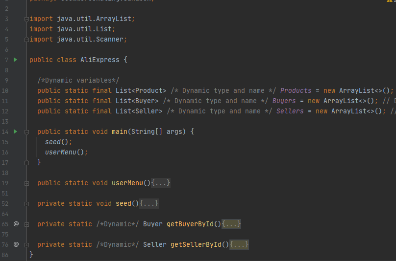
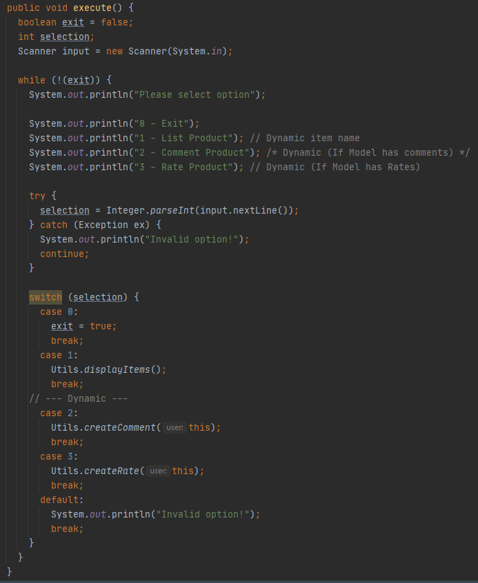

# EDOM Project, Part 2 - Team Report

## Metamodel Revision


Minor updates:

* Fixed some multiplicities that were reversed by mistake in the diagram.

Major updates:

* Removed ApprovalOutcome as it was useless
* Approval Step now has an optional reference for a next step in case of a successful validation
* Approval Step now has an optional reference for a next step in case of a failed validation

The above changes were required in order to be able to decide the validation process execution flow. The previous Metamodel wouldn't allow to decide which step should be taken next based on the result (success or failure) of the current step .

### Metamodel Constraints Revision

* Added a constraint to invalidate the model in case of a duplicated element name is detected.

This was done to avoid any problems down the road when generating code. Classes with the same name are not allowed within the same application.
**Attribute**s could potentially be removed from this constraint, to allow **Attribute**s with the same name and different **DataType**s, but if referenced by the same model element it would also cause invalid code to be generated as **Attribute** names within a class must be unique. Due to this **Attribute** names must also be unique within the **Model**.

-----

## Design Concrete Syntax for the DSL

### Graphical syntax

*For this representation only 2 shapes were chosen to avoid any conflicts with specific shapes not being available in all the editors.*

* **Model**:
  * This element is the root element, therefore it doesn't have a graphical representation
* **Data Type**:
  * Shape: Circle
  * Color: Dark Gray
  * Border: Solid Black
  * Font Color: White
* **Attribute**:
  * Shape: Circle
  * Color: Gray
  * Border: Solid Black
  * Font Color: Black
* **User**:
  * Shape: Rectangle
  * Color: Blue
  * Border: Solid Black
  * Font Color: Black
* **Item**:
  * Shape: Rectangle
  * Color: Yellow
  * Border: Solid Black
  * Font Color: Black
* **Comment**:
  * Shape: Rectangle
  * Color: Red
  * Border: Solid Black
  * Font Color: Black
* **Rate**:
  * Shape: Rectangle
  * Color: Green
  * Border: Solid Black
  * Font Color: Black
* **Review**:
  * Shape: Rectangle
  * Color: Light Green
  * Border: Solid Black
  * Font Color: Black
* **Approval Process**:
  * Shape: Rectangle
  * Color: Orange
  * Border: Solid Black
  * Font Color: Black
* **Approval Start**:
  * Shape: Circle
  * Color: Light Green
  * Border: Solid Black
  * Font Color: Black
* **Approval Step**:
  * Shape: Circle
  * Color: Light Blue
  * Border: Solid Black
  * Font Color: Black
* **Approval Outcome**:
  * Shape: Circle
  * Color: Light Red
  * Border: Solid Black
  * Font Color: Black

### Textual syntax

Below it is the representation how the editor should look. Another feature is that all lists can use folding, which results in better organization. This can be very useful for users when they are making a model with a lot of information.

* **Model**:

```
'model' <var: name>
'{'
    'Attributes:'  
        <list of: Attribute> 
    'User:'  
        <User> 
    'Item:'  
        <Item> 
    'Reviews:'  
        <Review> 
    'Comment:'
        <Comment>
    'Rate:'
        <Rate>
    'Approval Processes:'  
        <list of: ApprovalProcess>
'}'
```

* **Attribute**:

```
'attribute' <var: name> 'of type' <dataType>
```

* **User**:

```
<var: name>
'{'
    'Attributes:'  
        <list of refs: Attribute>
'}'
```

* **Item**:

```
<var: name>
'{'  
    'Attributes:'  
        <list of refs: Attribute>
    'Has comment' <ref: Comment>
    'Has rate' <ref: Rate>
'}'
```

* **Comment**:  

```
<var: name>
'{'
     'Attributes:'
         <list of refs: Attribute>
     'Authors:' 
          <list of refs: User>
     'Has approval process' <ref: ApprovalProcess>
'}'
```

* **Review**:

```
<var: name>
'{'
     'Attributes:'
         <list of refs: Attribute>
'}'
```

* **Rate**:

```
<var: name>
'{'
     'Attributes:'
         <list of refs: Attribute>
     'Authors:' 
          <list of refs: User>
     'Has review' <ref: Review>
     'Has approval process' <ref: ApprovalProcess>
'}'
```

* **Approval Process**:

```
<var: name>
{'
    'Start point:' <var: startPointName> 'has step' <ref: ApprovalStep>
    'Steps:'  
        <list of refs: ApprovalStep>
'}'
```

* **Approval Step**:

```
'approval step' <var: name>{
  'success step:'
    <ref to: approvalStep>
  'failure step:'
    <ref to: approvalStep>
}
```

-----

## Specify Common Features for Applications of the Domain

All the domain applications to be generated will be java console applications. Java language was chosen since 2 of 3 tools (MPS and Eclipse) natively support Java code generation.
This application is a simple simple console application where the user needs to login and for each type of user there might be different menus/options available according to what is specified in the model.
To persist our data we use lists in memory. We choose this approach since this is a demonstration tool that doesn't require a complex solution with database or other methods of persistence.
Since the applications are all very simple console applications no specific frameworks/architectures were used to keep it as simple as possible. Some were used patterns to avoid losing manually developed code after re-generating the code again.

-----

## Identify Commonality and Variability in the Code

Our application must have at least 5 Java classes, this will be our common classes:

* Main (This class will be named after the **Model** name (e.g: Amazon))
* **User** (It can be 1 or more classes with this template. It will be renamed to the name given (e.g: Buyer, Seller, Staff, etc))
* IUser (Interface that will be implemented by **User**. This class will help managing **User** behavior)
* **Item** (This class will be renamed to the name given (e.g: Product, New, Article, etc))
* **Utils** (Class that will contain the logic to add comments, add rates and display items)

Optional classes:

* **Rate** (This class will be renamed to the name given to the Rate concept)
* **Comment** (This class will be renamed to the name given to the Comment concept)
* **Review** (This class will be renamed to the name given to the Review concept)
* **ApprovalProcess** as many of these as there are ApprovalProcess concepts on the model (These classes will be renamed to the name given to the ApprovalProcess concept)
* **ApprovalStep** as many of these as there are ApprovalProcess concepts on the model (These classes will be renamed to the name given to the ApprovalStep concept)
* **ApprovalStepImpl** 1 for each ApprovalStep class. These should contain the validation method for a single step. This has been design this way to protect manually developed code from being lost between successive code generations.
* **SApprovalFactory** this is a factory for creating all the steps for all the processes, it's just a centralized place to create instances of the ApprovalSteps concrete implementations and reduce maintenance effort.


### Main class



In this class we can spot some variable code and common code. As stated before, we will have at least 1 class of User (In this case we have 2, Buyer and Seller) and one Item class (Product). We store this in lists and made them public and static to be accessible across the whole application and in to implement persistence in memory.
This class will have 3 common methods:

1. main(String[] args): all content it's common since it is the start of application;
2. userMenu():

  

It contains a variable menu (many menu options as User models) with a variable menu selection.

3. seed(): it will contain all the data to be initialized. The content of this method should be added manually;

### User

There can be several classes derived from this concept that are used to represent the Users this application.
This class contains a constructor with all attributes. We chose only this constructor to be easier to populate data on seed().


#### Common

This class implements IUser and have a common attribute, Id. We defined that all classes from User template should have an Id because it is an important attribute for search users, in this application it is user for user selection (login scenario).
This class will always have 2 methods: execute() and toString() (although their contents will be variable as will be shown below).

#### Variable

This class will also contain as much attributes as defined in model (in this case we have "Name" of String type).
This class contains a constructor with all attributes. We chose only this constructor to be easier to populate data on seed().

Now, this class has 2 common methods:

* toString(): this method serve to display User information to client(console). We decided to add this method to be easier display information on console.


* execute(): this method will execute the User's logic. It displays User menu with 2 common options (0 - Exit, 1- listing items) and all other menu options are variable. The first option we decided that all users should be able to see the items, as there is no problem for a user to see all the items in the system and their information.  

The next two options are variable and the user can have both, one of them or none. These options should only be enabled if the User can be the author of Comment or Rate.



### Product

This class is used to represent the Item concept from this application and aggregate the comments and rates in case they are present in this application, it has no methods (except toString for displaying product information).
This class contains a constructor with all attributes. We chose only this constructor to be easier to populate data on seed().

#### Common

This class always contains an Id field. We defined that all classes from product template should have an Id because it is an important attribute for search products, in this application it is product for product selection (login scenario).

#### Variable

This class will may also contain a Comments field of type List<Comment> to store all the comments associated with the product.
This class will may also contain a Rates field of type List<Rate> to store all the rates associated with the product.
This class will also contain as much attributes as defined in model (in this case we have "Name" and "Description" of String type).


Now, this class has 2 common methods:

* toString(): this method serve to display product information to client(console). We decided to add this method to be easier display information on console.
The Comments and Rates are optional and will only be present is the product is associated to rates or comments.have both, one of them or none.

### Comment

This class is only used to represent the Comment concept from this application, it has no methods (except toString for displaying comment information).

#### Common

This class contains only the default constructor to be used during the creation of the Comment (The Utils class will contain the logic to dynamically create and fill the entity regardless of the fields).
This class always contains the fields Id and Author.

#### Variable

It will also contain a boolean Approved field in case there is an approval regarding comment.
It will also contain as much attributes as defined in model (in this case we have "Name" of String type).


### Rate

This class is only used to represent the Rate concept from this application, it has no methods (except toString for displaying Rate information).

#### Common

This class contains only the default constructor to be used during the creation of the Rate (The Utils class will contain the logic to dynamically create and fill the entity regardless of the fields).
This class always contains the fields Id and Author.

#### Variable

It will also contain a Review field in case there is a Review associated to the Rate.
It will also contain a boolean Approved field in case there is an approval regarding Rate.
It will also contain as much attributes as defined in model (in this case we have "Name" of String type).


### Review

This class is only used to represent the Review concept from this application, it has no methods (except toString for displaying Review information).

#### Common

This class contains only the default constructor to be used during the creation of the Review (The Utils class will contain the logic to dynamically create and fill the entity regardless of the fields).
This class always contains the fields Id.

#### Variable

It will also contain as much attributes as defined in model (in this case we have "Name" of String type).


### ApprovalProcess

There can be several classes derived from this concept that are used to represent the ApprovalProcesses in this application.
This class has no attributes, it will only contain methods implementations to define the flow of an approval process.

#### Common

This classes can have 1 or 2 methods depending on wether the process applies to comments, rates or both: initApprovalProcess with an overload if required

#### Variable

The only variable part is which step the approval process calls first, to then trigger the validation flow. It should use the SApprovalFactory to get the steps.


### ApprovalStep

There can be several classes derived from this concept that are used to represent the ApprovalSteps in this application.
This class has no attributes, it will only contain methods implementations to define the flow of an approval process.

#### Common

This classes can have 2 methods `execute` and `validate` (with an overload depending on wether the process applies to comments, rates or both)

#### Variable

The only variable part is which step the approval step calls next or if it just returns the current result. It should use the SApprovalFactory to get the steps.


### SApprovalFactory

#### Variable

This class will contain as much creation methods as steps defined in the model. (by default it returns null and needs to be replaced after the steps implementation being created)


-----

## Design and Implement Code Generation

In the subsections below can be found the code generation rules for the different concepts of the metamodel.

***Note***: The code between brackets (e.g. **`[Model.User.Name]`**) found in the code samples below is **meta-code** for the template engines. The meta-code below it's not written in any specific language, it's just meant to be used to guide the team when implementing the templates in each specific tool and should be replaced by the tool's specific code.

### IUser Code Generation Rules

***Note:*** 1 IUsers interface per model.

```java
package crr.testmodel;

interface IUser {
    void execute();
}
```

### User Code Generation Rules

***Note:*** It will create as many classes as User concept instances in the model.

```java
package crr.[Model.Name.ToLower()];

public class [Model.User.Name] implements IUser { 
   
    public int Id; 
    //[foreach attr : Model.User.Attributes]
    public [attr.DataType] [attr.Name];
    //[endfor]
        
    public [user.Name](int id, /*[foreach attr : Model.User.Attributes]*/[attr.DataType] [attr.Name] /* [endfor] */) { 
        Id = id; 
        //[foreach attr : Model.User.Attributes]
        this.[attr.Name] = [attr.Name];  
        //[endfor] 
    } 
        
    public string toString() { 
        string res = ""; 
        res += "Id: " + Id + ";\n"; 
        //[foreach attr : Model.User.Attributes]
        res += "[attr.Name]" + [attr] + ";\n"; 
        //[endfor]
        return res; 
    } 
        
    public void execute() { 
        boolean exit = false; 
        int selection; 
        Scanner input = new Scanner(System.in); 
        
        while (!exit) { 
        System.out.println("Please select option"); 
            
        System.out.println("0 - Exit"); 
        System.out.println("1 - List " + [Model.Item.Name]); 
        //[if Model.Comment.Authors.any(u -> u == this)]
        System.out.println("2 - Comment " + [Model.Item.Name]); 
        //[endif]
        //[if Model.Rate.Authors.any(u -> u == this)]
            //[if Model.Comment != null]
        System.out.println("3 - Rate" + [Model.Item.Name]); 
            //[else]
        System.out.println("2 - Rate" + [Model.Item.Name]); 
            //[endif]
        //[endif]
            
        try { 
            selection = Integer.parseInt(input.nextLine()); 
        } catch (Exception ex) { 
            System.out.println("Invalid option!"); 
            continue; 
        } 
            
        switch (selection) { 
            case 0 : 
                exit = true; 
                break; 
            case 1 : 
                Utils.displayItems(); 
                break;
            //[if Model.Comment.Authors.any(u -> u == this)]
            case 2 : 
                Utils.createComment(this); 
                break; 
            //[endif]
            //[if Model.Rate.Authors.any(u -> u == this)]
            //[if Model.Comment != null]
            case 3 : 
            //[else]
            case 2:
            //[endif]
                Utils.createRate(this); 
                break; 
            //[endif]
            default : 
                System.out.println("Invalid option!"); 
                break; 
        } 
        } 
    } 
}
```

### Review Code Generation Rules

***Note:*** 1 class per model in case Review concept is present in the model.

```java
package crr.[Model.Name.ToLower()];

public class [Model.Review.Name] { 
    public int Id; 
    //[foreach attr : Model.User.Attributes]
    public [attr.DataType] [attr.Name];
    //[endfor]
        
    public [Model.Review.Name]() { } 
        
    public string toString() { 
        string res = ""; 
        //[foreach attr : Model.User.Attributes]
        res += "[attr.Name]" + [attr] + ";\n"; 
        //[endfor]
    } 
}
```

### Rate Code Generation Rules

***Note***: 1 class per model in case Rate concept is present in the model.

```java
package crr.[Model.Name.ToLower()];

public class [Model.Rate.Name]
{
    public int Id;

    public IUser Author;

    // [if(null != Model.Rate.ApprovalProcess)]
    public boolean Approved;
    // [ endif ]

    // [if(null != Model.Rate.Review && null != Model.Rate.Review)]
    public [Model.Rate.Review.Name] [Model.Rate.Review.Name];
    // [ endif ]

    // [foreach(var attr in Model.Rate.Attributes)]
    public [attr.DataType.Name] [attr.Name];
    // [ endfor ]

    public [Model.Rate.Name](){}

    public [Model.Rate.Name](int id, IUser author
    // [foreach(var attr in Model.Rate.Attributes)]
        , [attr.DataType.Name] [attr.Name]
    // [ endfor ]
    )
    {
        this.Id = id;
        this.Author = author;
    // [foreach(var attr in Model.Rate.Attributes)]
        this.[attr.Name] = [attr.Name];
    // [ endfor ]
    }

    public String toString(){
        var res = "Id: " + this.Id + ";\nAuthor: " + this.Author + ";";

    // [foreach(attr in Model.Rate.Attributes)]
        res += "\n[attr.Name]: " + this.[attr.Name] + ";";
    // [ endfor ]
    // [if(null != Model.Rate.Review)]
    {
        res += "\n[Model.Rate.Review.Name]: " + (null == this.[Model.Rate.Review.Name] ? "": this.[Model.Rate.Review.Name].toString()) + ";";
    // [ endif ]

        return res;
    }
}
```

### Comment Code Generation Rules

***Note***: 1 class per model in case Comment concept is present in the model.

```java
package crr.[Model.Name.ToLower()];

public class [Model.Comment.Name]
{
    public int Id;
    
    public IUser Author;

    // [if(null != Model.Comment.ApprovalProcess)]
    public boolean Approved;
    // [ endif ]

    // [foreach(var attr in Model.Comment.Attributes)]
    public [attr.DataType.Name] [attr.Name];
    // [ endfor ]

    public [Model.Comment.Name](){}

    public [Model.Comment.Name](int id, IUser author
    // [foreach(var attr in Model.Comment.Attributes)]
        , [attr.DataType.Name] [attr.Name]
    // [ endfor ]
    )
    {
        this.Id = id;
        this.Author = author;
    // [foreach(var attr in Model.Comment.Attributes)]
        this.[attr.Name] = [attr.Name];
    // [ endfor ]
    }

    public String toString(){
        var res = "Id: " + this.Id + ";\nAuthor: " + this.Author + ";";
    // [foreach(var attr in Model.Comment.Attributes)]
        res += "\n[attr.Name]: " + this.[attr.Name] + ";";
    // [ endfor ]

        return res;
    }
}
```

### Item Code Generation Rules

***Note***: 1 class per model in case Item concept is present in the model.

```java
package crr.[Model.Name.ToLower()];

import java.util.ArrayList;
import java.util.List;

public class [Model.Item.Name]
{
    public int Id;

    // [if(null != Model.Item.Comment)]
    public final List<[Model.Item.Comment.Name]> [Model.Item.Comment.Name]s = new ArrayList<>();
    // [ endif ]

    // [if(null != Model.Item.Rate)]
    public final List<[Model.Item.Rate.Name]> [Model.Item.Rate.Name]s = new ArrayList<>();
    // [ endif ]

    // [foreach(var attr in Model.Item.Attributes)]
    public [attr.DataType.Name] [attr.Name];
    // [ endfor ]

    public [Model.Item.Name](){}

    public [Model.Item.Name](int id
    // [foreach(var attr in Model.Item.Attributes)]
    , [attr.DataType.Name] [attr.Name]
    // [ endfor ]
    )
    {
        this.Id = id;
    // [foreach(var attr in Model.Item.Attributes)]
        this.[attr.Name] = [attr.Name];
    // [ endfor ]
    }

    public String toString(){
        var res = "Id: " + this.Id + ";";

    // [foreach(var attr in Model.Item.Attributes)]
        res += "\n[attr.Name]: " + this.[attr.Name] + ";";
    // [ endfor ]

    // [if(null != Model.Item.Comment)]
        res += "\n[Model.Item.Comment.Name]s:\n";
        for (var comment: [Model.Item.Comment.Name]s /*[if (null != Model.Comment.ApprovalProcess)]*/.stream().filter(c -> c.Approved).toArray()/*[ endif ]*/) {
            res += null == comment ? "" : comment.toString();
            res += "\n-----------\n";
        }
    // [ endif ]

    // [if(null != Model.Item.Rate)]
        res += "\n[Model.Item.Rate.Name]s:\n";
        for (var rate: [Model.Item.Rate.Name]s /*[if (null != Model.Rate.ApprovalProcess)]*/.stream().filter(c -> c.Approved).toArray()/*[ endif ]*/)
        {
            res += null == rate ? "" : rate.toString();
            res += "\n-----------\n";
        }
    // [ endif ]

        return res;
    }
}
```

### Utils Code Generation Rule

***Note:*** 1 class per model

```java
package crr.[Model.Name.ToLower()];

public class Utils { 
    //[if Model.Comment != null]
    public static void createComment(IUser user) { 
        Scanner input = new Scanner(System.in); 
        [Model.Comment.Name] comment = new [Model.Comment.Name](); 
            
        System.out.println("Comment section"); 
            
        System.out.println("Select item id: "); 
        string itemId = input.nextLine(); 
            
        [Model.Item.Name] item = getItemById(Integer.parseInt(itemId)); 
        if (item == null) { 
            System.out.println("Item not found!"); 
            return; 
        } 
        List<string> attributesNotToShow = Arrays.asList("Id", "Author", "Approved"); 
            
        for (int i = 0; i < comment.getClass().getDeclaredFields().length; i++) { 
            Field attr = comment.getClass().getDeclaredFields()[i]; 
            if (attributesNotToShow.contains(attr.getName())) { continue; } 
            
            setFieldValue(attr, comment); 
        } 
            
        comment.Author = user; 
        item.Comments.add(comment); 
    } 
     //[endif]
     
    //[if Model.Rate != null]
    public static void createRate(IUser user) { 
        Scanner input = new Scanner(System.in); 
        [Model.Rate.Name] rate = new [Model.Rate.Name](); 
            
        System.out.println("Rate section"); 
        System.out.println("Select item id: "); 
        string itemId = input.nextLine(); 
            
        [Model.Item.Name] item = getItemById(Integer.parseInt(itemId)); 
        if (item == null) { 
            System.out.println("Item not found!"); 
            return; 
        } 
        
        List<string> attributesNotToShow = Arrays.asList("Id", "Author", "Review", "Approved"); 
        
        for (int i = 0; i < rate.getClass().getDeclaredFields().length; i++) { 
            Field attr = rate.getClass().getDeclaredFields()[i]; 
            if (attributesNotToShow.contains(attr.getName())) { continue; } 
            
            setFieldValue(attr, rate); 
        } 
        
        //[if Model.Review != null]
        System.out.println("You want to review too? [Y]es/No(Press any key)"); 
        string opt = input.nextLine(); 
        if (opt.equals("y") || opt.equals("Y")) { 
            System.out.println("Review"); 
            [Model.Review.Name] review = new [Model.Review.Name](); 
        
            try { 
                for (int i = 0; i < review.getClass().getDeclaredFields().length; i++) { 
                    Field attr = review.getClass().getDeclaredFields()[i]; 
                    
                    if (attr.getName() == "Id") { continue; } 
                    
                    System.out.println(attr.getName() + ": "); 
                    string attrvalue = input.nextLine(); 
                    
                    switch (attr.getType().getName()) { 
                        case "int" : 
                            attr.set(review, Integer.parseInt(attrvalue)); 
                            break; 
                            
                        case "double" : 
                            attr.set(review, Double.parseDouble(attrvalue)); 
                            break; 
                            
                        default : 
                            attr.set(review, attrvalue); 
                        break; 
                    } 
                } 
            } catch (Exception ex) { 
                ex.printStackTrace(); 
            } 
            
            rate.Review = review; 
        } 
        //[endif]
        
        rate.Author = user; 
        item.Rates.add(rate); 
    } 
    //[endif]     
     
    public static void displayItems() { 
        for (int i = 0; i < [Model.Name][Model.Items]s.size(); i++) { 
            System.out.println( [Model.Name][Model.Items]s.get(i)); 
            System.out.println("======================="); 
        } 
    }      
     
    private static [Model.Item.Name] getItemById(int id) { 
        [Model.Item.Name] itemSelected = null; 
        
        for (int i = 0; i < [Model.Name][Model.Items]s.size(); i++) { 
            if ([Model.Name][Model.Items]s.get(i).Id == id) { 
                itemSelected = [Model.Name][Model.Items]s.get(i); 
                break; 
            } 
        } 
       
        return itemSelected; 
    }      
     
    private static void setFieldValue(Field field, Object obj) { 
        System.out.println(field.getName() + ": "); 
        Scanner input = new Scanner(System.in); 
        string fieldValue = input.nextLine(); 
        
        try { 
            switch (field.getType().getName()) { 
            case "int" : 
                field.set(obj, Integer.parseInt(fieldValue)); 
                break; 
            case "double" : 
                field.set(obj, Double.parseDouble(fieldValue)); 
                break; 
            case "float" : 
                field.set(obj, Float.parseFloat(fieldValue)); 
                break; 
            case "boolean" : 
                field.set(obj, Boolean.parseBoolean(fieldValue)); 
            default : 
                field.set(obj, fieldValue); 
                break; 
            } 
        } catch (Exception ex) { 
            ex.printStackTrace(); 
        } 
    } 
}
```

### ApprovalProcess Generation Rule

***Note:*** It will create as many classes as ApprovalProcess concept instances in the model.

```java
package crr.[Model.Name.ToLower()];

public abstract class [Model.ApprovalProcess.Name] { 
    //[if Model.Comment != null && Model.Comment.ApprovalProcess == this]
    public static boolean initApprovalProcess($[Model.Comment.Name] comment) { 
        boolean res = SFactoryApprovalFactory.create[Model.ApprovalProcess.Start.Step.Name]().executeComment(comment, null); 
            
        if (res) { return true; } 
            
        System.out.println("Comment not approved"); 
        return false; 
    } 
    //[endif]
     
    //[if Model.Rate != null && Model.Rate.ApprovalProcess == this]
    public static boolean initApprovalProcess([Model.Rate.name] rate) { 
        boolean res = SFactoryApprovalFactory.create[Model.ApprovalProcess.Start.Step.Name]().executeRate(rate, null); 
            
        if (res) { return true; } 
            
        System.out.println("Rate not approved"); 
        return false; 
    } 
  //[endif]
}
```

### ApprovalStep Generation Rule

***Note:*** It will create as many classes as ApprovalStep concept instances in the model.  

```java
package crr.[Model.Name.ToLower()];

public abstract class [this.ApprovalStep.Name] {    
    //[if Model.Comment != null && Model.Comment.ApprovalProcess == this.parent]
    public boolean execute([Model.Comment.Name] comment, HashMap<String, Object> args) { 
        boolean res = this.validate(comment); 
        boolean ret = false; 
        
        if (res) { 
            //[if this.SuccessStep != null]
            ret = SFactoryApprovalFactory.create[this.SuccessStep.Name]().execute(comment, null); 
            //[else]
            ret = true; 
            //[endif]
        } 
        //[if this.FailureStep != null]
        else { 
            ret = SFactoryApprovalFactory.create[this.FailureStep.Name]().execute(comment, null); 
        } 
        //[endif]
     
        return ret; 
    } 
    //[endif]
     
    //[if Model.Rate != null && Model.Rate.ApprovalProcess == this.parent]
    public boolean execute($MAP_SRC$RateImpl rate, HashMap<String, Object> args) { 
        boolean res = this.validate(rate); 

        boolean ret = false; 

        if (res) { 
            //[if this.SuccessStep != null]
            ret = SFactoryApprovalFactory.create[this.SuccessStep.Name]().execute(rate, null); 
            //[else]
            ret = true; 
            //[endif]
        } 
        //[if this.FailureStep != null]
        else { 
            ret = SFactoryApprovalFactory.create[this.FailureStep.Name]().execute(rate, null); 
        } 
        //[endif]

        return ret; 
    } 
    //[endif]
     
    //[if Model.Comment != null && Model.Comment.ApprovalProcess == this.parent]
    protected abstract boolean validate([Model.Comment.Name] comment); 
    //[endif]
     
    //[if Model.Rate != null && Model.Rate.ApprovalProcess == this.parent]
    protected abstract boolean validate([Model.Rate.Name] rate); 
    //[endif]
}
```

### SFactory Generation Rule

***Note:*** 1 class per model.

```java
package crr.[Model.Name.ToLower()];

public class SApprovalFactory { 
  //[foreach step in Model.ApprovalProcess.selectMany(p => p.Steps)]
  public static [step.Name] create[step.Name]() { 
    return null; 
  } 
  //[endfor]
}
```

### Model Code Generation Rules

***Note***: 1 class per model.

```java
package crr.[Model.Name.ToLower()];

import java.util.ArrayList;
import java.util.List;
import java.util.Scanner;

public class [Model.Name]
{
    public static final List<[Model.Item.Name]> [Model.Item.Name]s = new ArrayList<>();
    
    // [foreach(var user in Model.Users)]
    public static final List<[user.Name]> [user.Name]s = new ArrayList<>();
    // [ endfor ]

    public static void main(String[] args)
    {
        seed();
        userMenu();
    }

    public static void userMenu()
    {
        int selection = -1;
        Scanner input = new Scanner(System.in);

        while (true)
        {
            displayUserMenu();

            try {
                selection = Integer.parseInt(input.nextLine());
            } catch (Exception ex) {
                System.out.println("Invalid option!");
                continue;
            }

            switch (selection)
            {
                case 0:
                    return;

                // [int i = 1;]
                // [foreach(var user in Model.Users)]
                case [i]:
                    get[user.Name]ById().execute();
                    break;
                // [i++;]
                // [ endfor ]
                default:
                    System.out.println("Invalid option!");
                    break;
            }
        }
    }

    private static void displayUserMenu()
    {
        System.out.println("Roles Menu");
        System.out.println("0- Exit");

        // [i = 1;]
        // [foreach(var user in Model.Users)]
        System.out.println("[i]- [user.Name]");
        // [i++;]
        // [ endfor ]
    }

    private static void seed()
    {
        // add stuff to populate users and items
    }

    // [foreach(var user in Model.Users)]
    private static IUser get[user.Name]ById()
    {
        Scanner input = new Scanner(System.in);

        for (var user : [user.Name]s)
        {
            System.out.println(user.toString());
        }

        int selection;
        try {
            selection = Integer.parseInt(input.nextLine());
        } catch (Exception ex) {
            System.out.println("Invalid option!");
            return null;
        }

        return [user.Name]s.stream().filter(b->b.Id == selection).findFirst().get();
    }
    // [ endfor ]
}
```

-----

## Generate Applications

The code generation between applications (MPS and MS) is slightly different in the generation of classes for each model. The main difference is that MS only generates only a Java file for each concept created, while MPS generates one Java file for each concept instance. For example, if we have 2 User instances, Buyer and Seller, the MS generates a Java file that contains both classes. If the MPS has to generate the same code, it will generate 2 Java files where each one will contain a class, one for Buyer and another for Seller.
Another main difference is that MS when generating code has the option to only run the desired templates, while MPS will delete all the files that are in the output and generate them again.
That being said although the files count/names may be different and MS tool having the need to change the classes access modifier due to Java language constraints, the code from the several tools can be combined without issues.

### MPS vs MS

Note that MS classes aren't public, but package-private instead. This is not an issue if the code needs to be combined with the code produced by the other tools. This also allows the classes like Product to be placed in an Item.java file without causing compilation issues.

#### MPS Product.java

```java
package crr.testmodel;

/*Generated by MPS */

import java.util.List;
import java.util.ArrayList;

public class Product {

  public int Id;
  public String Name;
  public String Description;
  public final List<Rate> Rates = new ArrayList<Rate>();
  public final List<Comment> Comments = new ArrayList<Comment>();

  public Product() {
  }

  public Product(int id, String Name, String Description) {
    Id = id;
    this.Name = Name;
    this.Description = Description;
  }

  public String toString() {
    String res = "";

    res += "Id: " + Id + ";\n";
    res += "Name" + ": " + Name + ";\n";
    res += "Description" + ": " + Description + ";\n";

    res += "\nComments:\n";
    for (Comment comment : Comments) {
      if (comment.IsApproved) {
        res += comment.toString();
        res += "---------\n";
      }
    }

    res += "\nRates:\n";
    for (int i = 0; i < Rates.size(); i++) {
      res += Rates.get(i).toString();
      res += "---------\n";
    }

    return res;
  }
}

```

#### MS Item.java

```java
package crr.testmodel;

import java.util.ArrayList;
import java.util.List;

class Product
{
    public int Id;

    public final List<Comment> Comments = new ArrayList<>();
    public final List<Rate> Rates = new ArrayList<>();

    public String Name;

    public String Description;

    public Product(){}

    public Product(int id
    , String Name
    , String Description
    )
    {
        this.Id = id;
        this.Name = Name;
        this.Description = Description;
    }

    public String toString(){
        var res = "Id: " + this.Id + ";";
        res += "\nName: " + this.Name + ";";
        res += "\nDescription: " + this.Description + ";";

        res += "\nComments:\n";
        for (var comment: Comments.stream().filter(c -> c.Approved).toArray()) {
            res += null == comment ? "" : comment.toString();
            res += "\n-----------\n";
        }

        res += "\nRates:\n";
        for (var rate: Rates.stream().filter(c -> c.Approved).toArray())
        {
            res += null == rate ? "" : rate.toString();
            res += "\n-----------\n";
        }

        return res;
    }
}
```

#### MPS IUser.Java

```java
package crr.testmodel;

/*Generated by MPS */


public interface IUser {
  void execute();
}
```

#### MPS Buyer.Java

```java
package crr.testmodel;

/*Generated by MPS */

import java.util.Scanner;

public class Buyer implements IUser {

  public int Id;
  public String Name;

  public Buyer(int id, String Name) {
    Id = id;
    this.Name = Name;
  }

  public String toString() {
    String res = "";
    res += "Id: " + Id + ";\n";
    res += "null: " + Name + ";\n";
    return res;
  }

  public void execute() {
    boolean exit = false;
    int selection;
    Scanner input = new Scanner(System.in);

    while (!(exit)) {
      System.out.println("Please select option");

      System.out.println("0 - Exit");
      System.out.println("1 - List " + "Product");
      System.out.println("2 - Comment " + "Product");
      System.out.println("3 - Rate " + "Product");

      try {
        selection = Integer.parseInt(input.nextLine());
      } catch (Exception ex) {
        System.out.println("Invalid option!");
        continue;
      }

      switch (selection) {
        case 0:
          exit = true;
          break;
        case 1:
          Utils.displayItems();
          break;
        case 2:
          Utils.createComment(this);
          break;
        case 3:
          Utils.createRate(this);
          break;
        default:
          System.out.println("Invalid option!");
          break;
      }
    }
  }
}
```

#### MPS GeneralUser.java

```java
package crr.testmodel;

/*Generated by MPS */

import java.util.Scanner;

public class GeneralUser implements IUser {

  public int Id;
  public String Name;

  public GeneralUser(int id, String Name) {
    Id = id;
    this.Name = Name;
  }

  public String toString() {
    String res = "";
    res += "Id: " + Id + ";\n";
    res += "null: " + Name + ";\n";
    return res;
  }

  public void execute() {
    boolean exit = false;
    int selection;
    Scanner input = new Scanner(System.in);

    while (!(exit)) {
      System.out.println("Please select option");

      System.out.println("0 - Exit");
      System.out.println("1 - List " + "Product");
      System.out.println("2 - Comment " + "Product");

      try {
        selection = Integer.parseInt(input.nextLine());
      } catch (Exception ex) {
        System.out.println("Invalid option!");
        continue;
      }

      switch (selection) {
        case 0:
          exit = true;
          break;
        case 1:
          Utils.displayItems();
          break;
        case 2:
          Utils.createComment(this);
          break;
        default:
          System.out.println("Invalid option!");
          break;
      }
    }
  }
}
```

#### MS Users.Java

```java
package crr.testmodel;

interface IUser {
    void execute();
}


class Buyer implements IUser
{
    public int Id;

    public String Name;

    public Buyer(){}

    public Buyer(int id
    , String Name
    )
    {
        this.Id = id;
        this.Name = Name;
    }

    public String toString()
    {
        var res = "Id: " + this.Id + ";";
        res += "\nName: " + this.Name + ";";

        return res;
    }

    @Override
    public void execute()
    {
        int selection = -1;
        var input = new java.util.Scanner(System.in);

        while (true)
        {
            System.out.println("Please select option: ");

            System.out.println("0- Exit");
            System.out.println("1 - List Products");
            System.out.println("2 - Comment Product");
            System.out.println("3 - Rate Product");

            try
            {
                selection = Integer.parseInt(input.nextLine());
            } 
            catch (Exception ex)
            {
                System.out.println("Invalid option!");
                continue;
            }

            switch (selection)
            {
                case 0:
                    return;
                case 1:
                    Utils.displayItems();
                    break;
                case 2:
                    Utils.createComment(this);
                    break;
                case 3:
                    Utils.createRate(this);
                    break;
                default:
                    System.out.println("Invalid option!");
                    break;
            } 
        }
    }
}

class GeneralUser implements IUser
{
    public int Id;

    public String Name;

    public GeneralUser(){}

    public GeneralUser(int id
    , String Name
    )
    {
        this.Id = id;
        this.Name = Name;
    }

    public String toString()
    {
        var res = "Id: " + this.Id + ";";
        res += "\nName: " + this.Name + ";";

        return res;
    }

    @Override
    public void execute()
    {
        int selection = -1;
        var input = new java.util.Scanner(System.in);

        while (true)
        {
            System.out.println("Please select option: ");

            System.out.println("0- Exit");
            System.out.println("1 - List Products");
            System.out.println("2 - Comment Product");

            try
            {
                selection = Integer.parseInt(input.nextLine());
            } 
            catch (Exception ex)
            {
                System.out.println("Invalid option!");
                continue;
            }

            switch (selection)
            {
                case 0:
                    return;
                case 1:
                    Utils.displayItems();
                    break;
                case 2:
                    Utils.createComment(this);
                    break;
                default:
                    System.out.println("Invalid option!");
                    break;
            } 
        }
    }
}
```
