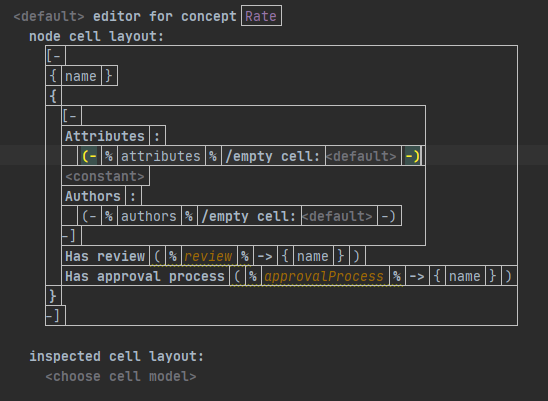
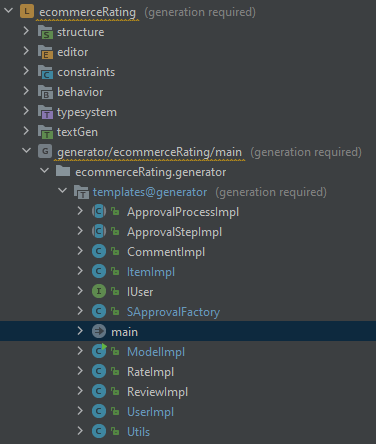
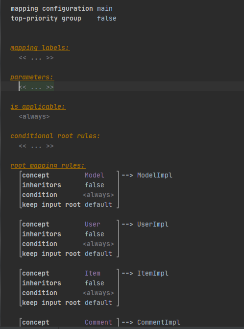
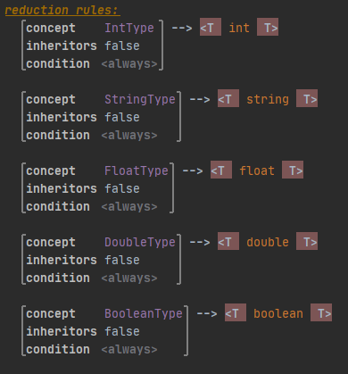
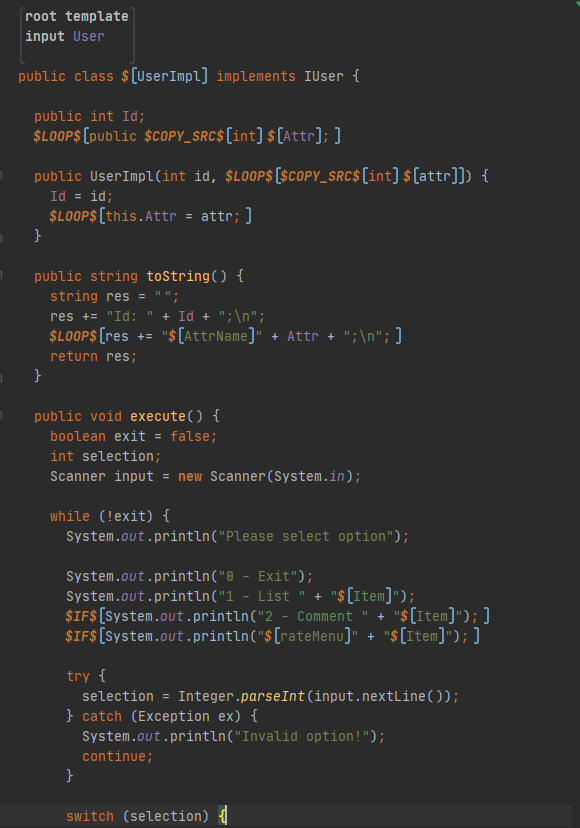
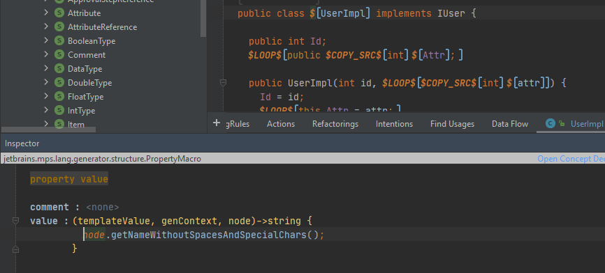
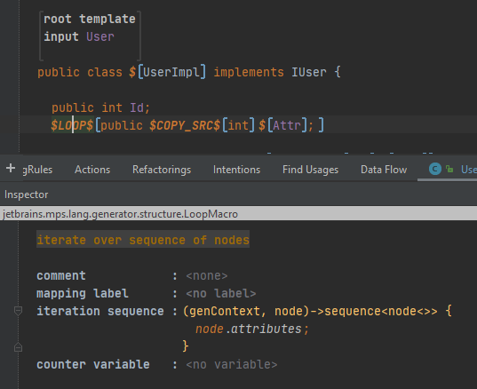
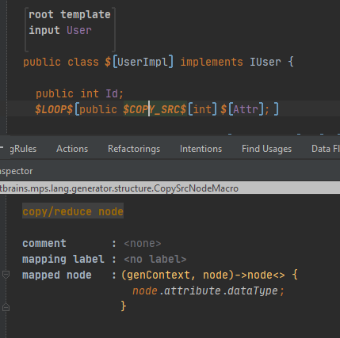
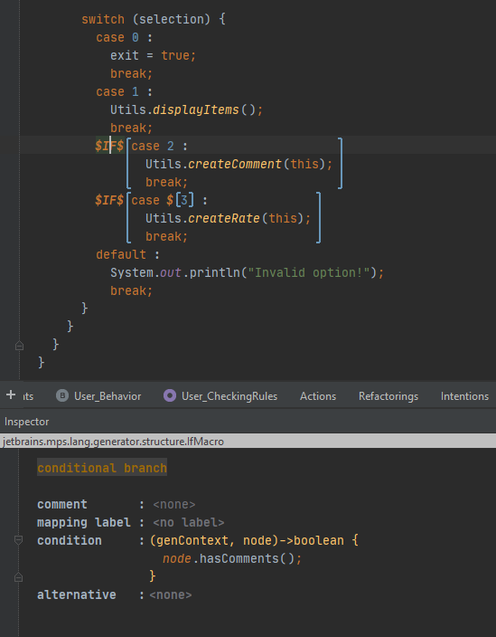
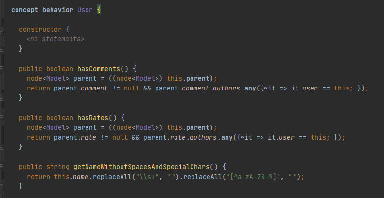

# EDOM Project, Part 2, Tool 1

In this folder you should add **all** artifacts developed for part 2 of the EDOM Project, related to tool 2.

You should also include in this file the report for this part of the project (only for tool 1).

**Note:** If for some reason you need to bypass these guidelines please ask for directions with your teacher and **always** state the exceptions in your commits and issues in bitbucket.

## Design Concrete Syntax for the DSL

As described in Part 1, we can change how models are displayed by creating Editors for each concept. These editors allow us to change how models are displayed to be more intuitive and productive.  

To create these Editors we just need:  
* Right click on "editor";
* Choose "New" -> "Concept Editor";
* On "editor for concept" we choose the Concept we want;
* On "node cell layout" it's where we apply the layout we want to present on sandbox;

As represented in the image above we can have:
* static text (known as *"constant"*);
* concept properties (represented with **% %**);
* lists (represented with **[- -]**):
* references to other concepts.  

## Design and Implement Code Generation
In MPS there are several ways to generate code from the model created.  

### TextGen
**TextGen** gives us the possibility to generate a file with any extension and then we have to write all the content as intended. Creating from TextGen, it will not check whether we are building our classes right or not, as it is interpreted only as text and not as a Java, XML, HTML, etc. This can cause some errors and it will only be able to notice them after generating the files and opening them with the correct IDE which can be more time consuming but in other hand we can create files with 0 restrictions.

### Generator  
There are also **Generators** (which was the approach used for this assignment) that contains templates to generate Java classes for each concept instance. It is possible to access the content of the instance, such as attributes, children (references that may have to other instances), methods created in the concept (known as *Concept Behavior*).  
Generators were used because they are already focused on the generation of Java classes and with more useful resources, such as providing a template and code checker for Java.  
(**WARNING:** Using Generators, the text generated by TextGen will not be generated and will be replaced by the generator. MPS cannot generate both)

In these generators it is possible to access all the existing packages in Java and for that, just add the packages in the generator by right-clicking on **templates@generator** and selecting the "Model properties" option. On the "Dependencies" tab, press the "+" button and add the desired package.

Here we use "java.util@java_stub" to be able to use Lists and "java.lang.reflect@java_stub" to use reflection, which is very useful to obtain all the attributes of an object.

    
The image above represents one Generator with all the templates created for each concept. For this templates to work it is needed to mapping each one on ***main***. We can also add more than one template for the same concept as will be described below. This file helps to map templates with concepts by doing:  
  

For this project the following templates were created:

* ApprovalProcessImpl (Template for ApprovalProcess): generates the code for all the approval processes elements present in the model;

* ApprovalStepImpl (Template for ApprovalStep): generates the code for all the approval steps elements present in the model;

* CommentImpl (Template for Comment): generates the code for comment element if present in the model;

* ItemImpl (Template for Item): generates the code for Item element present in the model;

* IUser (Template for Model): generates the code for interface IUser. It was use Model element because it is the root model and only exists one;

* SFactoryFactory (Template for Model): generates the code for SFactory class which its only job is to then contain the creation of all the steps in a centralized place to ease the maintenance when re-generating the code. It was use Model element because it is the root model and only exists one;

* ModelImpl: generates the code for the model element which contains the main application's method;

* RateImpl (Template for Rate): generates the code for Rate element if present in the model;

* ReviewImpl (Template for Review): generates the code for Review element if present in the model;

* UserImpl (Template for User): generates the code for User element present in the model;

* Utils (Template for Model): generates the code for the Utils class present in the prototypes with the applications utilitary methods;

We can also add reduction rules, which results in the transformation of a concept into another node. In this case, some concepts were created to represent primitive types such as:
* StringType;
* IntType;
* FloatType;
* DoubleType;
* BooleanType;  
 
Now, in our reduction rules, we have to say that if MPS finds one of these Concepts on the template, it must be replaced by the correct primitive type:
  

#### Templates
As stated before, in generator templates it contains the code that will generate the final code for each concept instance. For each template we need to specify the concept to be mapped inside template. Basically, these templates are interpreted and written as java classes, but we can also add macros that will help to obtain information about the concept instance.  

  

As we can see the content of a template it is very similar to Java with exception that the code in templates can be parameterized through macros. In this example, 2 of them are represented:  
* property macro - computes a property value;
      
    The $[UserImpl] represents a property macro and will replace the class name "UserImpl" with the name of the user instance, as shown in the inspector window. The getNameWithoutSpacesAndSpecialChars() method will return the concept instance name (these custom methods will be explained in the Concept Behavior section).
    Therefore, with this macro we can replace any property dynamically with some input data from the Concept instance.  

* node macro - it is used to control template filling at generation time. There is several versions of node macro used in this project:  

    * $LOOP$: this macro will loop through a given list. In this example, it will write *"public $COPY_SRC$int $Attr;"* for each *Attribute* that this User instance has.  
      
    * $COPY_SRC$: this macro will replace the current input node with a new one. In this case will replace int type to *DataType* from *Attribute*.
      
    * $IF$: with this macro it will write the code inside only if the condition is true.
      

#### Concept Behavior
 Virtual and non-virtual instance methods, static methods, and concept instance constructors on nodes that helps us to extract common operations to one place. In this project was created the method *getNameWithoutSpacesAndSpecialChars()* for all concepts, hasComments() and hasRate() for User concept.  
   
 Then in our generator templates, we can call these methods without worrying about applying the same logic to all templates.  

## Generate Applications

As is, the metamodel is lacking some fine details to comply with more specific applications restrictions, such as Maps model which should be only possible to add 1 Rate/Review for each Place.  

Another issue is having custom code, since MPS deletes all files and creates new ones before generating code, making it impossible to have custom code in the same folder as the project.